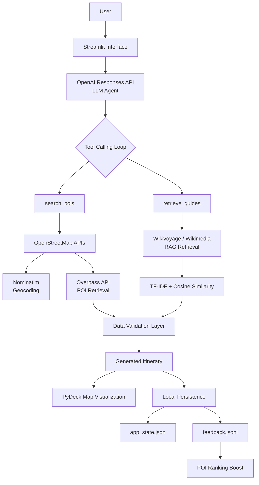

**AI Agents | Tool Calling | External API Integration | Retrieval-Augmented Generation (RAG) | Interactive Visualization**

---

## 🧭 Overview

This project demonstrates how to build an AI agent that combines **LLM reasoning, tool calling, external APIs, retrieval, validation, and interactive visualization** to generate personalized multi-day travel itineraries.

Rather than using the LLM only as a text generator, the application implements an agent workflow where the model can interact with external tools to retrieve real-world information, incorporate additional context through retrieval-augmented generation (RAG), and generate structured itineraries based on validated data.

The travel planner serves as the application domain, while the main focus of the project is the engineering of a reliable LLM-powered system.

---

## 🏗️ System Architecture



## 🤖 AI Agent Workflow

The application uses an iterative agent loop where the LLM can decide when external tools are required and incorporate returned information before generating the final itinerary.

Unlike a traditional chatbot that only generates text from a prompt, this system allows the model to interact with external data sources through custom tools, improving reliability and grounding recommendations in real-world information.


```text
User Preferences
        ↓
OpenAI Responses API Agent
        ↓
Tool Selection
        ↓
+-------------------------+
| search_pois             |
| retrieve_guides         |
+-------------------------+
        ↓
External Data Retrieval
        ↓
Validation of Returned Data
        ↓
Structured Itinerary Generation
        ↓
Interactive Visualization
```

### Tool Calling

The agent is provided with custom tools and can request their execution depending on the user's requirements.

Implemented tools:

- **`search_pois(city, interests, radius_km, limit, query)`**
  - Retrieves real-world points of interest (POIs) from OpenStreetMap.
  - Uses Nominatim for geocoding and Overpass API for POI retrieval.
  - Returns structured POI information including identifiers and coordinates.

- **`retrieve_guides(city, query, k)`**
  - Provides optional travel context through Wikivoyage/Wikimedia retrieval.
  - Uses TF-IDF ranking with cosine similarity to identify useful context for itinerary generation.

### Guardrails

To improve reliability and reduce unsupported model outputs:

- Tool schemas enforce structured inputs and outputs.
- Retrieved POIs are validated before being used in generated itineraries.
- The agent cannot reference POIs that were not returned by the retrieval tools.
- External API failures are handled through graceful fallbacks.


## 🤖 AI Agent Workflow
### Reliable LLM outputs

LLMs can generate plausible but incorrect information. To improve reliability:
- Tool schemas use strict validation.
- Generated itineraries are checked against retrieved POIs.
- The agent cannot reference POIs that were not returned by the retrieval tools.

### Integrating external APIs
The application combines multiple external data sources:
- OpenStreetMap for live geospatial information.
- Wikivoyage for optional travel knowledge retrieval.
This required handling external dependencies, structured responses, and potential service limitations.

### Combining structured and unstructured retrieval
The system combines:
- Structured geospatial retrieval:
      - POIs;
      coordinates;
      metadata
with:
- Unstructured text retrieval:
      - travel descriptions;
      contextual information
This allows the agent to generate recommendations based on both factual location data and additional travel context.

### User feedback integration
The application includes a lightweight feedback mechanism:
- Users can upvote or downvote recommended POIs.
- Feedback is stored locally.
- Previous preferences create a ranking boost for future POI searches for the same destination.

## 🧠 Technical Skills Demonstrated
- LLM Agent Development
- OpenAI Responses API
- Function Calling / Tool Calling
- Retrieval-Augmented Generation (RAG)
- External API Integration
- Data Retrieval Pipelines
- Structured Data Validation
- Geospatial Data Processing
- Interactive Data Visualization
- Python Application Development
- Local Data Persistence

## 📌 Key Insights
This project highlights several important considerations when building practical AI systems.

Key findings include:
- **LLMs become more reliable when combined with external tools and validation layers.** Rather than relying only on generated knowledge, the agent retrieves and verifies real-world information before producing results.
- **Agent systems require careful handling of external dependencies.** APIs introduce latency, failures, and incomplete data, requiring fallback strategies and robust execution flows.
- **Retrieval improves the quality of generated outputs.** Combining structured POI data with optional contextual retrieval allows the model to produce more relevant and grounded itineraries.
- **Interactive visualization improves usability of AI-generated results.** Mapping generated recommendations helps users understand and evaluate the produced itinerary.

Overall, the project demonstrates how LLMs can be integrated with traditional software engineering practices to build more reliable AI applications.


## 📦 Technologies
- Python
- OpenAI Responses API
- Streamlit
- PyDeck
- Pandas
- Scikit-learn
- OpenStreetMap APIs: Nominatim, Overpass API
- Wikivoyage / Wikimedia APIs
- Git
- JSON-based local persistence