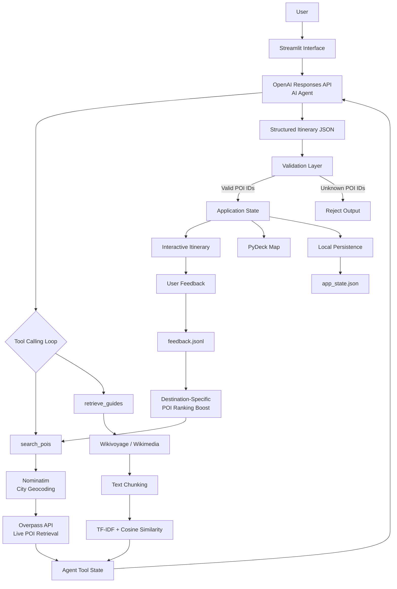
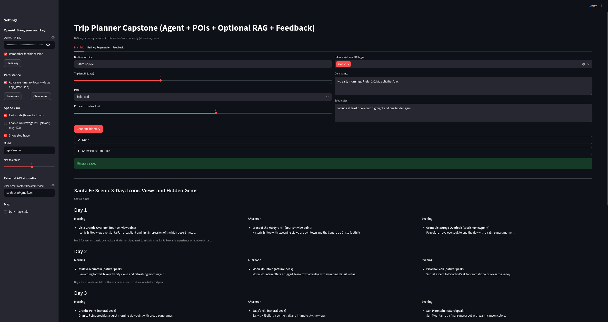
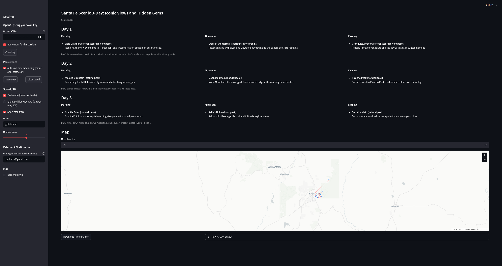

# Trip Planner AI Agent

**AI Agents | Tool Calling | External APIs | Retrieval-Augmented Generation | Geospatial Data | Interactive Visualization**

---

## 📌 Overview

This project implements a tool-using AI agent that generates personalized multi-day travel itineraries by combining **LLM reasoning with live geospatial data, retrieval-augmented generation, structured validation, persistent state, user feedback, and interactive maps**.

Rather than relying on an LLM as a standalone text generator, the system gives the model access to custom tools that retrieve real-world points of interest and optional travel-guide context. The agent iteratively decides when external information is required, consumes the returned data, and produces a structured itinerary grounded in retrieved POIs.

A validation layer prevents unsupported locations from entering the final itinerary, while additional engineering features—including API retries, execution traces, itinerary persistence, controlled regeneration, and feedback-based POI ranking—turn the agent into a complete interactive application rather than a simple chatbot.

---

## 🎯 Project Objectives

The application was designed to:

- Generate personalized multi-day itineraries from user preferences and constraints.
- Allow an LLM agent to retrieve external information through custom tools.
- Ground location recommendations in live OpenStreetMap data.
- Optionally enrich itinerary generation with Wikivoyage retrieval.
- Prevent the model from using POIs that were not returned by the retrieval layer.
- Produce structured itinerary outputs suitable for downstream processing.
- Visualize generated activities and routes on an interactive map.
- Allow users to refine entire itineraries or regenerate individual days.
- Persist generated plans across application restarts.
- Capture user feedback and incorporate it into future POI ranking.

---

## 🏗️ System Architecture



The architecture separates **LLM reasoning from external data retrieval and application validation**.

The model can request tools, but retrieved data is stored independently by the application and used to validate the final itinerary before it is accepted.

---

## 🔄 AI Agent Workflow

The core of the application is an iterative tool-calling loop built with the OpenAI Responses API.

```text
User Preferences & Constraints
            ↓
OpenAI Responses API
            ↓
Agent Determines Required Tools
            ↓
    ┌───────────────────┐
    │    search_pois    │
    │  retrieve_guides  │
    └───────────────────┘
            ↓
External Data Retrieval
            ↓
Tool Results Returned to Agent
            ↓
Additional Tool Calls if Required
            ↓
Structured Itinerary Generation
            ↓
Application-Level Validation
            ↓
Persistent State + Visualization
```

The model receives previous tool outputs as part of the ongoing interaction, allowing it to gather information before producing the final response.

The maximum number of agent steps is configurable to prevent uncontrolled tool-calling loops.

---

## ⚙️ Core Components

### 🤖 Agent Orchestration

The application implements a multi-step agent loop around the OpenAI Responses API.

At each step, the model can either:

- Request one or more external tools.
- Consume returned tool results.
- Continue reasoning with the new information.
- Produce the final itinerary.

Tool calls and their outputs are appended back into the interaction so the model can reason over retrieved data rather than relying only on its internal knowledge.

The interface also exposes:

- Configurable OpenAI model selection.
- Maximum agent-step control.
- Fast mode for reducing unnecessary tool calls.
- Optional execution traces showing model and tool activity.

---

### 📍 Live POI Retrieval

The `search_pois` tool retrieves real-world points of interest using OpenStreetMap services.

```text
Destination
    ↓
Nominatim
    ↓
Latitude / Longitude
    ↓
Interest-to-OSM Tag Mapping
    ↓
Overpass API
    ↓
Structured POIs
```

User interests such as:

- outdoors
- museums
- food
- coffee
- history
- art
- nightlife
- scenic locations

are mapped to relevant OpenStreetMap tags.

Each returned POI contains structured information including:

- `poi_id`
- name
- category
- latitude
- longitude
- URL when available

These identifiers become the authoritative set of locations that the agent is allowed to reference.

---

### 📚 Optional Retrieval-Augmented Generation

The `retrieve_guides` tool provides additional travel context through Wikivoyage.

When RAG is enabled, the application:

1. Resolves the relevant Wikivoyage page.
2. Retrieves the page content.
3. Converts the content into plain text.
4. Splits the text into chunks.
5. Builds a TF-IDF representation of the chunks.
6. Converts the agent's retrieval query into the same vector space.
7. Ranks chunks using cosine similarity.
8. Returns the most relevant sections to the agent.

```text
Wikivoyage Content
        ↓
Text Extraction
        ↓
Chunking
        ↓
TF-IDF Vectorization
        ↓
Cosine Similarity
        ↓
Top-K Context
        ↓
AI Agent
```

This creates a lightweight RAG pipeline that can provide destination-specific context without replacing the structured POI retrieval layer.

If Wikivoyage retrieval is disabled or unavailable, itinerary generation can continue without it.

---

### 🛡️ Structured Tools & Output Validation

Both agent tools use strict schemas that define required arguments and reject unexpected properties.

The final itinerary is also required to follow a structured JSON format containing:

- title
- destination
- itinerary days
- morning activities
- afternoon activities
- evening activities
- notes
- optional retrieved sources

After generation, the application extracts the JSON and independently verifies every `poi_id`.

If the model references a location that was not returned by `search_pois`, the output is rejected rather than displayed to the user.

This creates a separation between:

```text
What the LLM generates
        ↓
What the application accepts
```

---

### 🔄 Itinerary Refinement & Controlled Regeneration

Generated itineraries can be modified without starting again from scratch.

The application supports two workflows:

#### Full Itinerary Refinement

Users can provide a new instruction such as changing the travel style or reducing walking.

The agent receives the existing itinerary and can retrieve additional POIs when alternatives are needed.

The revised itinerary is validated again before replacing the existing version.

#### Single-Day Regeneration

Users can regenerate one selected itinerary day while preserving the remainder of the trip.

The application performs an additional consistency check that compares the original and regenerated itineraries.

If the model changes any day other than the selected one, the new itinerary is rejected.

This provides application-level enforcement of targeted AI-generated edits rather than relying only on prompt instructions.

---

### 💾 Application State Persistence

Generated itinerary state is persisted locally in:

```text
data/app_state.json
```

The stored state includes:

- Generated itinerary.
- Retrieved and allowed POIs.
- Map center.
- Destination identifier.

When the application restarts, the persisted state can be reloaded so the generated itinerary is not lost.

Users can also:

- Enable or disable autosave.
- Save the current itinerary manually.
- Clear saved state.
- Download the itinerary as JSON.

---

### 👍 Feedback-Driven POI Ranking

The application includes a lightweight feedback loop for recommendations.

Users can:

- 👍 Upvote recommended POIs.
- 👎 Downvote recommended POIs.

Feedback events are stored as JSON Lines in:

```text
data/feedback.jsonl
```

When POIs are retrieved for the same destination in future searches, historical votes are converted into ranking boosts or penalties.

```text
User Vote
    ↓
feedback.jsonl
    ↓
Destination-Specific Feedback History
    ↓
POI Ranking Adjustment
    ↓
Future search_pois Results
```

This creates a simple persistent feedback mechanism between user interaction and future retrieval results.

---

## 🔍 How It Works

A typical trip-generation request follows this sequence:

1. The user enters a destination, trip length, pace, interests, and constraints.
2. The OpenAI agent receives the planning request.
3. The agent calls `search_pois` to retrieve available locations.
4. Nominatim resolves the destination coordinates.
5. Overpass retrieves POIs matching the selected interests.
6. Previous feedback can adjust POI ranking for that destination.
7. If enabled, the agent calls `retrieve_guides` for relevant Wikivoyage context.
8. Tool outputs are returned to the agent.
9. The agent generates a structured multi-day itinerary.
10. The application parses the returned JSON.
11. Every itinerary POI is checked against the retrieved POI registry.
12. Invalid outputs are rejected.
13. Valid itineraries are stored in application state.
14. The itinerary is automatically persisted locally when autosave is enabled.
15. Activities are rendered in a day-by-day interface and plotted on an interactive PyDeck map.
16. Users can refine the itinerary, regenerate a single day, or provide POI feedback.

---

## 🛡️ Validation & Reliability

The application includes several safeguards around the non-deterministic AI layer and external API dependencies.

### POI Grounding

The model is explicitly instructed to reference retrieved `poi_id` values rather than inventing location identifiers.

Application-level validation then verifies those identifiers against the POIs actually returned by the tools.

### Strict Tool Schemas

Both agent tools define:

- Required properties.
- Input types.
- Numeric bounds.
- Rejection of unexpected properties.

### Selective-Regeneration Validation

When regenerating a single day, the application compares every unaffected day against the previous itinerary.

If unrelated days were changed, the update is rejected.

### External API Failure Handling

OpenStreetMap retrieval includes:

- Request timeouts.
- Retry attempts.
- Exponential waiting when rate limits are encountered.
- Structured error returns when retrieval fails.

Wikivoyage retrieval is optional, allowing itinerary generation to continue when additional guide context is unavailable.

### API Usage Controls

The application provides a Fast mode that limits unnecessary tool calls and exposes a configurable maximum number of agent steps.

### Execution Tracing

Model calls and tool executions can be recorded in a visible execution trace containing:

- Model steps.
- Tool names.
- Tool arguments.
- Tool results.
- Execution times.
- Tool errors.

This makes the agent workflow easier to inspect and debug.

---

## 🖼️ Application Demo

The application provides an interactive interface for generating, refining, validating, and exploring AI-generated travel itineraries.

### Trip Planning Interface

Users can configure:

- Destination.
- Trip length.
- Travel pace.
- Search radius.
- Interests.
- Constraints.
- Additional preferences.
- OpenAI model.
- RAG usage.
- Agent step limits.



### Generated Itinerary & Map Visualization

Generated itineraries are displayed by day with separate:

- Morning activities.
- Afternoon activities.
- Evening activities.
- Explanations for each recommendation.

The PyDeck map displays retrieved itinerary POIs using their real coordinates.

Users can:

- Display all itinerary days.
- Filter the map by individual day.
- View POI details through map tooltips.
- Visualize paths between daily activities.
- Switch between light and dark map styles.



---

## 🔑 Credential Management

The application uses a Bring Your Own Key workflow for OpenAI access.

Users can provide an API key directly through the Streamlit interface.

The active key is kept in Streamlit session state for use by the application and can be manually cleared.

For local development, an optional:

```text
api.txt
```

file can preload the API key when a session starts.

The application itself does not write API keys to persistent storage.

---

## ⚙️ Key Technical Challenges

### Building a Real Tool-Using Agent

The application required more than sending a single prompt to an LLM.

The agent needed an orchestration loop capable of:

- Detecting tool requests.
- Executing the correct Python functions.
- Tracking retrieved information.
- Returning tool results to the model.
- Continuing until a final response was generated.
- Preventing uncontrolled execution through configurable step limits.

### Grounding LLM Outputs in External Data

An LLM can generate plausible but unsupported locations.

The application addresses this by maintaining an authoritative registry of POIs retrieved during tool execution and independently validating the generated itinerary against that registry before accepting it.

### Combining Structured & Unstructured Retrieval

The system integrates two different retrieval approaches:

**Structured retrieval**
- POI identifiers
- coordinates
- categories
- URLs

**Unstructured retrieval**
- Wikivoyage text
- contextual travel information
- ranked document chunks

Both forms of information must be transformed into tool outputs that can be consumed by the same agent loop.

### Working with Public Geospatial APIs

The application depends on several public external services with different interfaces and failure modes.

This required handling:

- Geocoding.
- Dynamic Overpass query generation.
- Rate limits.
- Request timeouts.
- Retries.
- User-Agent requirements.
- Missing API responses.

### Making AI-Generated Edits Predictable

Allowing a model to regenerate only part of an existing structured object introduces additional reliability problems.

The single-day regeneration workflow therefore verifies that all non-target days remain exactly unchanged before accepting the result.

### Maintaining Application State Across Reruns

Streamlit reruns the application when interface controls change.

Itinerary data, allowed POIs, map state, and persistence logic therefore had to be separated from individual button interactions so the generated trip remained available while users interacted with the interface.

### Integrating User Feedback Into Retrieval

Feedback needed to affect future recommendations without retraining a model.

The project implements a lightweight ranking layer where persistent upvotes and downvotes modify future POI ordering for the corresponding destination.

---

## 💡 Key Insights

- **LLM reliability improves when generation is separated from validation.** The agent can propose an itinerary, while deterministic application logic decides whether its POIs are valid.

- **Tool calling turns the LLM into an orchestration component rather than the sole source of information.** Live location data is retrieved externally and returned to the model when needed.

- **Structured and unstructured retrieval solve different problems.** OpenStreetMap provides location-grounded structured POIs, while Wikivoyage can provide contextual information through RAG.

- **Agent workflows require explicit execution boundaries.** Tool-call limits, step limits, validation checks, and external API error handling are important parts of the system architecture.

- **AI-generated edits benefit from deterministic post-validation.** Verifying that unaffected itinerary days remain unchanged makes targeted regeneration more controlled.

- **Feedback can improve retrieval without model retraining.** Persistent POI votes provide a lightweight mechanism for adapting future search rankings.

- **Persistent state is essential for interactive AI applications.** Separating itinerary state from individual UI events prevents generated work from disappearing during interface reruns.

- **Visualization makes structured AI output easier to evaluate.** Mapping recommendations exposes the geographic relationships between generated activities rather than presenting the itinerary only as text.

---

## 🚀 Future Improvements

- Add budget-aware restaurant and accommodation recommendations.
- Integrate travel-time estimation between POIs using a routing API such as OSRM.
- Support multi-city itineraries with explicit travel days.
- Replace TF-IDF retrieval with embedding-based retrieval and FAISS.
- Add a SQLite-backed trip library for managing multiple saved itineraries.

---

## 🧠 Technical Skills Demonstrated

- LLM Agent Development
- Agent Orchestration
- OpenAI Responses API
- Function Calling / Tool Calling
- Retrieval-Augmented Generation
- External API Integration
- Data Retrieval Pipelines
- Structured Data Validation
- LLM Output Guardrails
- Geospatial Data Processing
- TF-IDF Information Retrieval
- Interactive Data Visualization
- Stateful Application Development
- Feedback-Driven Ranking
- API Error Handling
- Python Application Development
- Local Data Persistence

---

## 📦 Technologies

- Python
- OpenAI Responses API
- Streamlit
- PyDeck
- NumPy
- Scikit-learn
  - TF-IDF Vectorization
  - Cosine Similarity
- OpenStreetMap APIs
  - Nominatim
  - Overpass API
- Wikivoyage / Wikimedia API
- Requests
- JSON / JSONL Local Persistence
- Git
