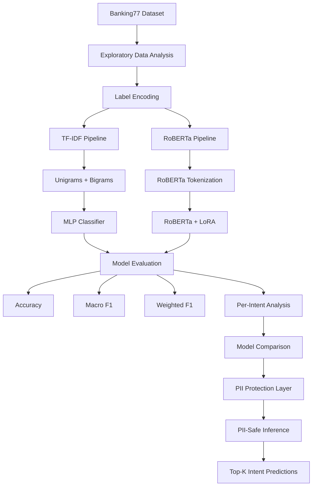
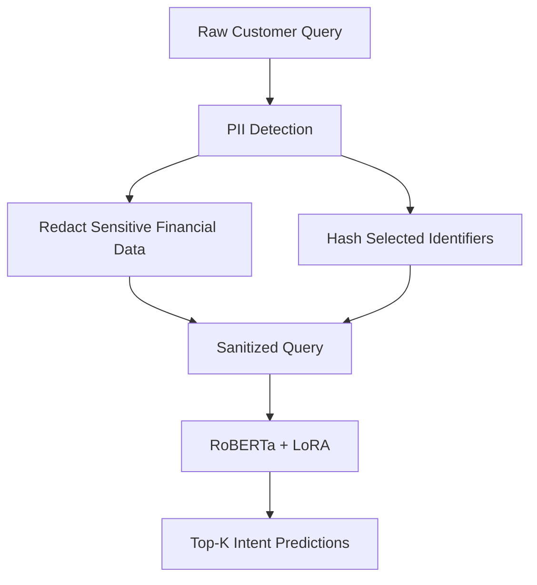

# Banking Customer Intent Classification

**Natural Language Processing | Intent Classification | Parameter-Efficient Fine-Tuning | LoRA | Privacy-Aware ML**

---

## 📌 Overview

This project develops an end-to-end natural language processing pipeline for identifying the intent behind banking customer queries.

Using the **Banking77** dataset, the system classifies short customer messages into **77 distinct banking intents**, covering topics such as card issues, unrecognized payments, transfers, cash withdrawals, identity verification, direct debits, and account services.

The project compares two modelling approaches:

1. A **TF-IDF + Multi-Layer Perceptron (MLP)** baseline.
2. A pretrained **RoBERTa model fine-tuned with LoRA (Low-Rank Adaptation)**.

The transformer-based approach reaches approximately **93.4% accuracy and macro F1**, compared with approximately **88.0%** for the baseline, while LoRA makes only about **1.9% of the full model parameters trainable**.

Beyond classification performance, the project integrates a dedicated **PII-protection layer into the inference pipeline**, ensuring that sensitive customer information is redacted or hashed before model prediction.

---

## 🎯 Problem Definition

Banking support systems receive large volumes of short natural-language requests that must be routed to the correct service or support workflow.

The challenge is not simply identifying broad topics such as cards or payments. Many of the 77 Banking77 intents are semantically close and use overlapping vocabulary.

For example:

```text
card_not_working
contactless_not_working
declined_card_payment
card_payment_not_recognised
cash_withdrawal_not_recognised
direct_debit_payment_not_recognised
```

The modelling objective is therefore to distinguish between **fine-grained customer intents** while maintaining reliable performance across the full multi-class problem.

The project also explores whether parameter-efficient transformer fine-tuning can provide a meaningful performance improvement over a conventional text-classification baseline.

---

## 🏗️ Modelling Pipeline



The workflow separates model development from the privacy-aware prediction layer, allowing sensitive information to be processed before inference.

---

## 📊 Dataset

The project uses the **Banking77** dataset, which contains short natural-language banking queries labelled according to customer intent.

### Dataset Characteristics

- **77 unique intent classes**
- **13,083 total queries**
- **10,003 training examples**
- **3,080 test examples**

The test set contains **40 examples per intent**, providing a balanced basis for per-class evaluation.

Example categories include:

- Card problems
- Unrecognized payments
- Cash withdrawals
- Identity verification
- Transfers
- Direct debits
- Exchange rates
- Cash withdrawal issues
- Account and banking services

The large number of closely related labels makes Banking77 a useful benchmark for fine-grained intent classification.

---

## 🔍 Exploratory Data Analysis

Before modelling, the dataset was explored to understand class behaviour and the characteristics of the customer queries.

### Class Distribution

Intent frequencies were examined across the training data to identify differences in representation between categories.

The analysis showed modest variation in class frequency, while the test dataset remained balanced across all 77 classes.

### Query Length Analysis

Query-length distributions were examined across intent categories.

Most banking requests are relatively short, reflecting the concise language typically used when customers describe a specific problem or request.

### Word Clouds

Word clouds were generated for frequently occurring intent classes to inspect dominant vocabulary.

The analysis showed strong lexical relationships between several intent labels and their associated queries, while also highlighting overlapping terminology between related banking issues.

This overlap reinforces the need for models capable of capturing contextual differences rather than relying only on isolated keywords.

---

## ⚙️ Data Preprocessing

Two separate preprocessing pipelines were created for the baseline and transformer models.

### Label Encoding

The 77 textual intent labels were converted into numerical class identifiers using `LabelEncoder`.

The same label mapping was maintained across training, evaluation, and inference.

### TF-IDF Representation

For the MLP baseline, customer queries were converted into sparse TF-IDF vectors using:

```text
Lowercase:          True
N-grams:            Unigrams + Bigrams
Minimum frequency:  2
Maximum frequency:  95%
Maximum features:   50,000
Accent stripping:   Unicode
```

The fitted vocabulary contained approximately **10,292 features** in the representative execution.

### RoBERTa Tokenization

For the transformer model, raw customer queries were processed using the `roberta-base` tokenizer.

The preprocessing pipeline includes:

- Subword tokenization.
- Maximum sequence length of **256 tokens**.
- Truncation of longer sequences.
- Dynamic batch padding using `DataCollatorWithPadding`.

This allows the transformer to operate directly on tokenized natural-language input rather than manually engineered text features.

---

## 🧠 Modelling Approach

### 1. TF-IDF + MLP Baseline

The first model establishes a conventional neural-network baseline.

The architecture consists of:

```text
TF-IDF Input
     ↓
Linear Layer
     ↓
512 Hidden Units + ReLU
     ↓
Linear Layer
     ↓
512 Hidden Units + ReLU
     ↓
77-Class Output Layer
```

Training configuration:

- **Cross-Entropy Loss**
- **AdamW optimizer**
- Learning rate: `1e-3`
- Weight decay: `1e-4`
- **5 training epochs**

The baseline provides a strong reference point for determining whether the additional complexity of transformer fine-tuning produces a meaningful improvement.

---

### 2. RoBERTa + LoRA

The second approach uses the pretrained **RoBERTa-base** transformer for sequence classification.

Instead of fine-tuning every transformer parameter, the model is adapted using **LoRA — Low-Rank Adaptation**.

LoRA adapters are applied to the self-attention:

- Query projections
- Key projections
- Value projections

Configuration:

```text
Rank (r):          32
LoRA Alpha:        64
LoRA Dropout:      0.05
Bias:              None
Target Modules:    query, key, value
```

The resulting model contains:

```text
Trainable parameters:    ~2.42M
Total parameters:        ~127.12M
Trainable proportion:    ~1.9%
```

This allows the model to adapt a pretrained transformer to the 77-class banking task while updating only a small fraction of the full network.

### Fine-Tuning Configuration

The representative training configuration includes:

- **10 epochs**
- Learning rate: `2e-4`
- Cosine learning-rate scheduler
- Warmup ratio: `0.1`
- Training batch size: `16`
- Evaluation batch size: `32`
- Random seed: `42`

---

## 📈 Model Evaluation

Both approaches were evaluated on the held-out Banking77 test dataset.

Evaluation metrics include:

- **Accuracy**
- **Macro F1**
- **Weighted F1**
- Per-intent precision
- Per-intent recall
- Per-intent F1

### Why Macro F1 Matters

With **77 separate intent classes**, aggregate accuracy alone does not show whether performance is consistent across categories.

Macro F1 calculates the F1 score independently for every intent and gives each class equal importance:

```text
Macro F1 = Mean(F1 for each intent)
```

This makes it particularly useful for evaluating whether performance improvements extend across the full intent space rather than being concentrated in only a subset of classes.

Because neural-network training can produce small differences between executions, headline performance is reported using rounded values.

---

## 🔄 Model Comparison

A representative execution produced:

| Model | Accuracy | Macro F1 | Weighted F1 |
|---|---:|---:|---:|
| TF-IDF + MLP | **87.99%** | **87.97%** | **87.97%** |
| **RoBERTa + LoRA** | **93.44%** | **93.43%** | **93.43%** |

In rounded terms:

```text
TF-IDF + MLP      ≈ 88.0%
RoBERTa + LoRA    ≈ 93.4%
```

The transformer approach improves macro F1 by approximately:

```text
+5.5 percentage points
```

while training only about **1.9% of the full RoBERTa parameter set**.

### Intent-Level Performance

The improvement was particularly visible for several closely related banking intents.

Representative results include:

| Intent | MLP F1 | RoBERTa + LoRA F1 |
|---|---:|---:|
| `contactless_not_working` | 57.6% | **97.4%** |
| `card_not_working` | 66.7% | **92.7%** |
| `verify_my_identity` | 71.2% | **92.7%** |
| `why_verify_identity` | 80.0% | **95.1%** |
| `extra_charge_on_statement` | 82.9% | **97.5%** |
| `unable_to_verify_identity` | 81.5% | **94.7%** |

The largest gains were concentrated around several **card-related** and **identity-verification** intents, where subtle semantic differences are especially important.

---

## 🔐 PII Protection

Banking customer messages can contain personally identifiable and financial information.

To prevent raw sensitive values from being passed directly into the classifier, the project implements a dedicated **PII-processing layer before inference**.

The preprocessing logic identifies and protects patterns including:

- Email addresses
- Phone numbers
- Social Security numbers
- Credit-card numbers
- Account and banking identifiers
- Routing numbers
- CVV / CVC numbers
- PIN numbers
- Dates of birth
- Names
- Driver's licence identifiers
- Postal addresses
- ZIP codes
- IP addresses
- Additional identifier patterns

### Redaction & Hashing

Most sensitive values are replaced with descriptive placeholders:

```text
[CARD NUMBER REDACTED]
[CVV NUMBER REDACTED]
[DOB REDACTED]
[ADDRESS REDACTED]
```

Email addresses and phone numbers can either be redacted or replaced with a shortened **SHA-256 hash**.

Example:

```text
john.doe@email.com
        ↓
[HASH:55f537baf75630a8]
```

This preserves a deterministic representation for repeated identifiers without exposing the original value.

### PII-Safe Inference Flow



### Example


The prediction function performs PII processing automatically before tokenization and classification.

---

## 🧪 Example Prediction

A representative customer query contains a payment dispute together with several pieces of sensitive information:

```text
"I want to dispute a charge of $49.99 on my card
4532-1234-5678-9010 and CVV 000.
My email is john.doe@email.com,
call me at 123-456-7890."
```

Before inference, the sensitive values are transformed:

```text
"I want to dispute a charge of $49.99 on my card
[CARD NUMBER REDACTED] and [CVV NUMBER REDACTED].
My email is [HASH:...],
call me at [HASH:...]."
```

The classifier can then return multiple ranked intent predictions.

A representative execution produced:

| Rank | Intent | Confidence |
|---:|---|---:|
| 1 | `direct_debit_payment_not_recognised` | **63.1%** |
| 2 | `extra_charge_on_statement` | **29.4%** |
| 3 | `card_payment_not_recognised` | **4.0%** |

The example highlights one of the central challenges of Banking77: multiple intents can be semantically related while still representing different customer-service workflows.

The highest-scoring classes all relate to unexpected or unrecognized charges, but distinguish between direct debits, additional statement charges, and card payments.

---

## ⚙️ Key Technical Challenges

### Distinguishing Fine-Grained Banking Intents

Banking77 contains **77 intent classes**, many of which describe closely related customer problems.

The model therefore needs to distinguish subtle contextual differences rather than simply detecting broad keywords such as "card", "payment", or "transfer".

---

### Establishing a Strong Baseline

A useful transformer comparison requires a meaningful reference model.

The TF-IDF + MLP baseline achieved approximately **88% accuracy**, providing a strong benchmark rather than an intentionally weak baseline.

This makes the improvement from RoBERTa + LoRA more informative.

---

### Parameter-Efficient Transformer Fine-Tuning

Full transformer fine-tuning requires updating a large number of parameters.

LoRA reduces this requirement by inserting trainable low-rank adapters into selected attention projections.

In this implementation, approximately:

```text
1.9%
```

of the complete RoBERTa parameter set is trainable.

This creates a more parameter-efficient adaptation strategy while retaining the representational capabilities of the pretrained transformer.

---

### Evaluating Performance Across 77 Classes

A single aggregate accuracy score can hide class-specific weaknesses.

The evaluation therefore includes:

- Macro F1
- Weighted F1
- Precision
- Recall
- Per-intent F1
- Direct comparison of intent-level improvements

This provides a more detailed understanding of where the transformer improves on the baseline.

---

### Protecting Sensitive Customer Input

Financial queries can naturally contain information that should not be passed directly through an inference pipeline.

PII protection was therefore integrated into the prediction workflow itself rather than being treated as a separate preprocessing demonstration.

The classifier receives the sanitized query after sensitive information has been redacted or hashed.

---

## 💡 Key Insights

- **RoBERTa + LoRA substantially outperformed the TF-IDF + MLP baseline**, reaching approximately **93.4% macro F1 compared with 88.0%**.

- **Parameter-efficient fine-tuning achieved this improvement while updating only ~1.9% of the full model parameters.**

- The strongest intent-level improvements appeared among several **card-related and identity-verification categories**, demonstrating the value of contextual transformer representations for closely related classes.

- The TF-IDF + MLP baseline remained a strong classifier, showing that conventional text representations can perform well when intent classes contain distinctive lexical patterns.

- Transformer modelling becomes particularly valuable when classes share similar vocabulary but differ in semantic meaning.

- **Macro F1 provides a more complete view of performance across 77 intents** than overall accuracy alone.

- Privacy considerations can be integrated directly into the inference architecture by sanitizing sensitive data before tokenization and classification.

- Returning **top-k predictions** provides additional visibility into ambiguous cases where several banking intents may be semantically plausible.

---

## 🚀 Future Steps

### Human-in-the-Loop Routing

Route low-confidence or ambiguous classifications to a human reviewer rather than automatically accepting the highest-probability intent.

### Active Learning

Use uncertain predictions to identify examples that would provide the most useful additional labelled data for future training.

### Hyperparameter Optimization

Explore:

- Alternative LoRA ranks.
- Different adapter target modules.
- Learning-rate configurations.
- Larger pretrained transformer models.

### Inference Optimization

Investigate techniques such as:

- Model quantization.
- Prediction caching.
- Reduced inference latency.

### Model Monitoring

Track:

- Prediction distributions.
- Classification performance.
- Confidence levels.
- Data drift.
- Changes in incoming customer language.

### Feedback-Driven Improvement

Capture corrected intent predictions and use them as labelled examples for future model iterations.

---

## 🧠 Technical Skills Demonstrated

- Natural Language Processing
- Multi-Class Text Classification
- Exploratory Data Analysis
- TF-IDF Feature Engineering
- Neural Network Development
- Deep Learning with PyTorch
- Transformer Fine-Tuning
- Parameter-Efficient Fine-Tuning
- LoRA
- Hugging Face Transformers
- Model Evaluation & Comparison
- Per-Class Performance Analysis
- Precision / Recall / F1 Analysis
- PII Detection & Data Protection
- Privacy-Aware ML Pipelines
- Data Visualization
- Python Machine Learning Development

---

## 📦 Technologies

- Python
- PyTorch
- Hugging Face Transformers
  - RoBERTa
- PEFT
  - LoRA
- Scikit-learn
- Pandas
- NumPy
- Matplotlib
- WordCloud
- Jupyter Notebook
- Git

---

## 📓 Analysis Walkthrough

