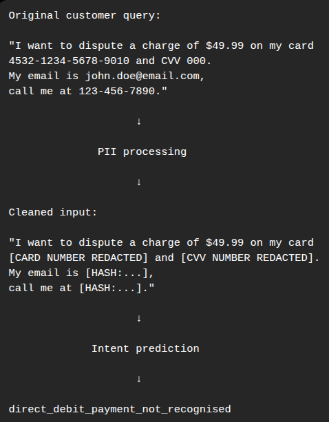

# 🏦 Banking Customer Intent Classification

**Natural Language Processing | Text Classification | Transformer Fine-Tuning | LoRA | Privacy-Aware ML**

---

## 🧭 Overview

This project develops a natural language classification pipeline for identifying the intent behind banking customer queries.

Using the **Banking77** dataset, the task is to classify short customer messages into **77 distinct banking intents**, ranging from card issues and payment problems to identity verification and account-related requests.

Rather than relying on a single model, the project compares two approaches:

1. A **TF-IDF + MLP** neural-network baseline
2. A **RoBERTa model fine-tuned using LoRA**

The project also incorporates a **PII protection step into the prediction workflow**, allowing sensitive information such as card details, email addresses, and phone numbers to be redacted or hashed before classification.

The main objective was to evaluate whether a parameter-efficient transformer approach could provide a meaningful improvement over a conventional text-classification baseline.

---

## 🏗️ System Architecture

The project follows the workflow below:

```text
                         Banking77 Dataset
                                │
                                ▼
                    ┌──────────────────────┐
                    │ Data Exploration &   │
                    │ Preprocessing        │
                    └──────────┬───────────┘
                               │
                 ┌─────────────┴─────────────┐
                 ▼                           ▼
          TF-IDF Vectorization        RoBERTa Tokenization
                 │                           │
                 ▼                           ▼
             MLP Model                RoBERTa + LoRA
                 │                           │
                 └─────────────┬─────────────┘
                               ▼
                      Model Evaluation
                               │
              ┌────────────────┼────────────────┐
              ▼                ▼                ▼
           Accuracy         Macro F1       Weighted F1
                               │
                               ▼
                       PII-Safe Inference
                               │
                               ▼
                     Predicted Intent
```
## 📊 Dataset

The project uses the **Banking77** dataset, containing short natural-language queries written as examples of banking customer requests.

### Dataset characteristics

- **77** unique intent classes
- **13,083** total queries
- **10,003** training examples
- **3,080** test examples

Examples include intents related to:

- card problems
- unrecognized payments
- cash withdrawals
- identity verification
- transfers
- direct debits
- account and banking services

Before modeling, the dataset was explored through several visualizations, including class distributions, query-length distributions, and word clouds for frequently occurring intents.

---

## 🧠 Modeling Approach

### 1. TF-IDF + MLP Baseline

The first approach provides a conventional neural-network baseline.

Customer queries are converted into numerical representations using **TF-IDF**, configured with:

- lowercase text
- unigrams and bigrams
- minimum document frequency of 2
- maximum document frequency of 95%
- up to 50,000 features

The resulting feature vectors are passed to a multilayer perceptron classifier with **77 output classes**.

This establishes a useful benchmark before introducing a pretrained transformer.

---

### 2. RoBERTa + LoRA

The second approach uses the pretrained **RoBERTa-base** transformer for sequence classification.

Instead of fine-tuning the entire model, I used **LoRA (Low-Rank Adaptation)** to perform parameter-efficient fine-tuning.

The LoRA configuration targeted the transformer's:

- query projections
- key projections
- value projections

with:

- rank: `32`
- LoRA alpha: `64`
- dropout: `0.05`

Only a small fraction of the full model was trainable:

**2.42M trainable parameters out of 127.12M total parameters (~1.9%)**

This allowed the project to use a pretrained transformer while updating substantially fewer parameters than full model fine-tuning.

---

## 📈 Model Comparison

The two approaches were evaluated using overall accuracy, macro F1, and weighted F1.

| Model | Accuracy | Macro F1 | Weighted F1 |
|---|---:|---:|---:|
| MLP baseline | 87.99% | 87.97% | 87.97% |
| **RoBERTa + LoRA** | **93.47%** | **93.47%** | **93.47%** |

### Key result

**RoBERTa + LoRA improved macro F1 by 5.48 percentage points over the MLP baseline.**

This improvement was also visible at the individual-intent level.

For example:

| Banking Intent | MLP F1 | RoBERTa + LoRA F1 |
|---|---:|---:|
| `contactless_not_working` | 57.6% | **96.1%** |
| `card_not_working` | 66.7% | **91.6%** |
| `verify_my_identity` | 71.2% | **94.0%** |
| `unable_to_verify_identity` | 81.5% | **96.1%** |
| `why_verify_identity` | 80.0% | **96.3%** |

The largest improvements were concentrated around several card-related and identity-verification intents.

---

## 🔐 PII Protection

Because banking customer queries can contain sensitive information, the prediction workflow includes a dedicated PII-processing step before classification.

The implemented pipeline can:

- redact credit-card information
- redact CVV information
- hash email addresses
- hash phone numbers

For hashed identifiers, the implementation uses SHA-256 and retains a shortened hash representation.

### Example



The prediction function can also return the top three predicted intents, rather than only the highest-probability class.

---

## 🔎 Example Prediction

For a customer query concerning an unexpected charge, the model produced a ranked set of possible intents.

The highest-probability predictions included:

| Rank | Intent |
|---:|---|
| 1 | `direct_debit_payment_not_recognised` |
| 2 | `extra_charge_on_statement` |
| 3 | `transaction_charged_twice` |

The example illustrates an important characteristic of banking intent classification: some intents are semantically close and can involve similar language while representing different customer issues.

---

## ⚙️ Key Technical Challenges

### Distinguishing closely related banking intents

With **77 separate classes**, several intents share similar vocabulary and subject matter. The model therefore needs to distinguish between subtle differences in customer requests rather than simply identifying broad banking topics.

### Establishing a meaningful baseline

The TF-IDF + MLP model provides a conventional neural-network reference point, making it possible to evaluate whether the additional complexity of a transformer-based approach translates into measurable improvements.

### Parameter-efficient transformer fine-tuning

Rather than updating the entire RoBERTa model, LoRA was used to adapt selected attention projections while keeping the number of trainable parameters relatively small.

### Protecting sensitive input data

The prediction workflow processes personally identifiable and financial information before classification, allowing example customer queries containing sensitive data to be handled without passing the original sensitive values directly into the model.

---

## 🧪 Evaluation

Model performance was evaluated using:

- **Accuracy**
- **Macro F1**
- **Weighted F1**
- Per-intent **precision**
- Per-intent **recall**
- Per-intent **F1**

Macro F1 was particularly useful for comparing performance across the 77 intents because it gives each class equal weight rather than allowing the most frequent intents to dominate the overall score.

The models were also evaluated across different execution environments, including a local GPU environment and Kaggle, producing similar results.

---

## 🚀 Future Steps

Possible extensions based on the current project include:

### Active learning

Use uncertain predictions to identify examples that would be most valuable for additional labeling and model improvement.

### Model monitoring

Track classification performance and changes in incoming data over time.

### Inference optimization

Explore techniques such as model quantization and caching to reduce inference cost and latency.

### Feedback-driven improvement

Introduce feedback loops that can provide additional training data for future iterations of the classifier.

---

## 💡 Key Takeaway

This project demonstrates a complete text-classification workflow for banking customer queries, moving from a **TF-IDF + MLP baseline** to **parameter-efficient RoBERTa fine-tuning with LoRA**.

The transformer-based approach achieved **93.47% accuracy and macro F1**, improving macro F1 by **5.48 percentage points** over the baseline.

Beyond model performance, the project also incorporates **PII protection directly into the prediction workflow**, making privacy considerations part of the classification pipeline rather than an afterthought.

### Analysis Walkthrough
