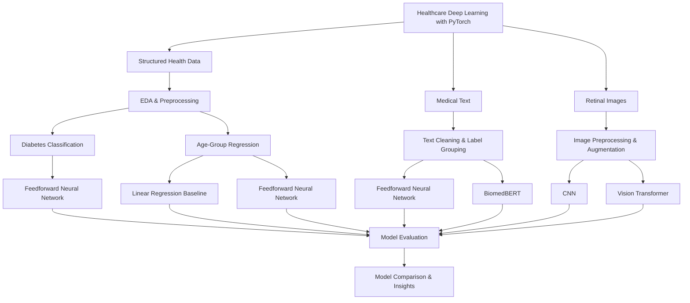

# Healthcare Deep Learning with PyTorch

**Tabular Modelling | Medical NLP | Computer Vision | Transfer Learning | PyTorch**

---

## 📌 Overview

This project explores how deep learning and transfer learning can be applied across **three different healthcare data modalities**:

1. Structured health and lifestyle data
2. Medical text
3. Retinal fundus images

Rather than applying a single modelling technique across all tasks, each modality uses a dedicated preprocessing and modelling pipeline suited to its underlying data.

The project consists of four predictive tasks:

- **Diabetes Classification** — binary classification from structured health and lifestyle variables.
- **Age-Group Regression** — prediction of an ordinal age-group value from the same structured dataset.
- **Medical Text Classification** — classification of medical question-answer content into five broader medical focus areas.
- **Retinal Image Classification** — binary classification of retinal images according to the presence of diabetic retinopathy.

Across these tasks, the project compares simpler baseline approaches with neural networks and pretrained transformer architectures, including **BiomedBERT** for medical NLP and a **Vision Transformer (ViT)** for retinal-image classification.

The work covers exploratory data analysis, preprocessing, class-imbalance handling, neural-network development, transfer learning, evaluation, and model comparison using **PyTorch**.

---

## 🎯 Problem Definition

Healthcare-related datasets can vary substantially in structure and modelling requirements.

A tabular dataset containing health and lifestyle indicators requires numerical preprocessing and class-balancing strategies, while medical text requires tokenization and protection against label leakage. Retinal images introduce a different set of challenges involving image preprocessing, augmentation, limited training data, and class imbalance.

The project therefore investigates how modelling strategies should change depending on the underlying data modality.

The three modelling tracks are:

### Structured Health Data

Predict:

- Whether an individual belongs to the **Diabetes** or **No Diabetes** class.
- The individual's ordinal **age-group value**.

### Medical Text

Classify medical question-answer text into one of five broader medical focus areas.

### Retinal Images

Classify retinal fundus images into:

```text
No Diabetic Retinopathy
Diabetic Retinopathy
```

The goal is not to develop a clinical diagnostic system, but to explore and compare deep-learning approaches across several healthcare-related modelling problems.

---

## 🏗️ Modelling Architecture



The architecture follows a shared Data Science workflow while allowing each modality to use its own preprocessing, modelling, and evaluation strategy.

---

# 🩺 1. Structured Health Data

## 🎯 Problem Definition

The first modelling track uses structured health and lifestyle information to investigate two predictive tasks.

### Diabetes Classification

The first task predicts whether an individual belongs to the:

```text
No Diabetes
Diabetes
```

class.

The original target contains three categories:

```text
No Diabetes
Prediabetes
Diabetes
```

Individuals labelled as **Prediabetes** were excluded to create a binary classification problem.

### Age-Group Regression

The second task predicts an individual's **age-group value** from the remaining health and lifestyle features.

Age is represented in the dataset using **13 ordered categories**.

Rather than treating these categories as unrelated classes, the task is modelled as regression so that their ordinal relationship is preserved.

---

## 📊 Dataset

The analysis uses data from the **CDC Behavioral Risk Factor Surveillance System (BRFSS) 2015**.

The initial dataset contains:

```text
253,680 observations
22 variables
```

The variables include health, behavioural, and demographic indicators such as:

- High blood pressure
- High cholesterol
- BMI
- Smoking status
- Stroke history
- Heart disease or heart attack
- Physical activity
- Fruit and vegetable consumption
- General health
- Mental health
- Physical health
- Sex
- Age group
- Education
- Income
- Diabetes status

---

## 🔍 Exploratory Data Analysis

One of the main issues identified during exploration was strong **class imbalance** in the diabetes target.

Before balancing:

```text
No Diabetes    ≈ 84.2%
Diabetes       ≈ 13.9%
```

The remaining observations corresponded to the prediabetes category, which was removed for the binary task.

The imbalance meant that overall accuracy alone would provide an incomplete picture of model performance because predictions biased toward the majority class could still obtain a high accuracy score.

Class-level precision, recall, and F1 therefore became important parts of the evaluation.

---

## ⚙️ Data Preprocessing

### Binary Target Construction

The diabetes target was converted to:

```text
No Diabetes → 0
Diabetes    → 1
```

Prediabetic observations were excluded.

### Class Balancing

The majority **No Diabetes** class was randomly undersampled while retaining all diabetic observations.

The resulting modelling dataset contained an approximately:

```text
50 / 50
```

class distribution.

### Feature Encoding

Categorical and ordinal variables were converted into numerical representations.

Examples include:

```text
Sex        → Binary encoding
Age        → Ordered values 1–13
Education  → Ordinal encoding
Income     → Ordinal encoding
```

Two features were removed:

```text
CholCheck
NoDocbcCost
```

The final modelling dataset contained **19 input features**.

### Train/Test Split

The balanced dataset was divided using an **80/20 train/test split**.

```text
Training observations: 56,553
Testing observations:  14,139
Input features:         19
```

---

## 🧠 Diabetes Classification

A feedforward neural network was implemented in PyTorch.

### Network Architecture

```text
19 Inputs
    ↓
48 Units + ReLU
    ↓
16 Units + ReLU
    ↓
12 Units + GELU
    ↓
1 Unit + Sigmoid
```

Training configuration:

```text
Loss:          Binary Cross-Entropy
Optimizer:     Adam
Learning Rate: 0.003
Epochs:        1000
```

### Model Evaluation

The model achieved:

| Metric | Result |
|---|---:|
| Test Accuracy | **75.53%** |
| No Diabetes Precision | 0.80 |
| No Diabetes Recall | 0.70 |
| No Diabetes F1 | 0.74 |
| Diabetes Precision | 0.72 |
| Diabetes Recall | **0.82** |
| Diabetes F1 | 0.77 |

The model identified approximately **82% of the diabetic-class observations** in the held-out test set.

The result also demonstrates why class-specific metrics matter: the model's behaviour cannot be fully described by its 75.53% overall accuracy alone.

---

## 📅 Age-Group Regression

The second structured-data task predicts the ordinal age-group value.

Two models were compared:

1. **Linear Regression**
2. **Feedforward Neural Network**

### Neural Network Architecture

```text
19 Inputs
    ↓
48 Units + ReLU
    ↓
24 Units + ReLU
    ↓
8 Units + ReLU
    ↓
1 Regression Output
```

Training configuration:

```text
Loss:          Mean Squared Error
Optimizer:     Adam
Learning Rate: 0.003
Epochs:        1000
```

### Model Evaluation

| Model | Test MSE |
|---|---:|
| Linear Regression | **6.17** |
| Feedforward Neural Network | **5.58** |

The neural network reduced test MSE compared with the linear-regression baseline.

Because the target represents an ordinal **age-group index**, the MSE refers to error in that encoded target space rather than an error measured directly in years.

The result suggests that the neural network captured nonlinear relationships between health variables and age-group values that were not represented as effectively by the linear model.

---

# 📚 2. Medical Text Classification

## 🎯 Problem Definition

The second modelling track focuses on **medical text classification**.

The task is to categorize medical question-answer content into broader medical focus areas.

Two approaches are compared:

1. A lightweight **feedforward neural network**
2. A domain-specific pretrained **BiomedBERT transformer**

This is a **medical focus-area classification task**, not a disease-diagnosis system.

---

## 📊 Dataset

The analysis uses the **MedQuAD** dataset.

The original data contains:

```text
16,412 question-answer pairs
5,126 unique focus areas
```

Directly modelling more than 5,000 sparsely represented labels would create an extremely fragmented classification problem.

The **25 most common focus areas** were therefore grouped into five broader categories:

1. **Neurological & Cognitive Disorders**
2. **Cancers**
3. **Cardiovascular Diseases**
4. **Metabolic & Endocrine Disorders**
5. **Other Age-Related & Immune Disorders**

After filtering to the selected focus areas and removing missing observations:

```text
647 observations remained
```

After duplicate answers were removed:

```text
624 observations remained
```

---

## ⚙️ Text Preprocessing

### Reducing Label Complexity

The original thousands of medical focus areas were reduced to five broader groups by mapping the selected high-frequency categories.

This created a more feasible multi-class modelling problem.

### Preventing Label Leakage

Some medical answers contained terminology directly associated with their target focus area.

Allowing these terms to remain could give the classifier an overly direct shortcut to the target label.

Focus-area keywords were therefore removed from the text before modelling, followed by whitespace normalization.

### Baseline Text Encoding

For the feedforward neural network:

- Text was converted to lowercase.
- Regular expressions were used for tokenization.
- A vocabulary was constructed from the training corpus.
- Unknown and padding tokens were added.
- Sequences were padded or truncated to **128 tokens**.
- Text was converted into PyTorch tensors.

### Train/Test Split

The dataset was divided into:

```text
80% training
20% testing
```

A stratified split was used to maintain representation of all five medical focus groups.

---

## 🧠 Feedforward Neural Network Baseline

The baseline uses a learned embedding representation followed by a small neural classifier.

### Architecture

```text
Token IDs
    ↓
Embedding Layer
Embedding Size: 50
    ↓
Mean Pooling
    ↓
100 Hidden Units + ReLU
    ↓
5-Class Output
```

The network was trained using:

```text
Cross-Entropy Loss
Adam Optimizer
Learning Rate: 0.0001
500 Epochs
```

### Model Evaluation

| Metric | Result |
|---|---:|
| Accuracy | **83%** |
| Macro Precision | 0.82 |
| Macro Recall | 0.80 |
| Macro F1 | 0.81 |

Performance varied across medical focus areas.

The lowest recall occurred for **Metabolic & Endocrine Disorders**, where recall reached approximately **0.53**.

The baseline nevertheless demonstrated that the processed medical text contained sufficient structure for a relatively compact neural architecture to distinguish between the five focus groups.

---

## 🤖 BiomedBERT Fine-Tuning

A domain-specific pretrained transformer was then used for the same classification task.

The selected model is:

```text
microsoft/BiomedNLP-BiomedBERT-base-uncased-abstract-fulltext
```

BiomedBERT was pretrained on biomedical literature, providing representations specifically adapted to biomedical terminology and language.

### Selective Fine-Tuning

Rather than updating every model parameter, the network was initially frozen and selected components were made trainable:

```text
Classification Head
Transformer Layers 9–11
Pooler
```

The remaining model parameters remained frozen.

Input text was tokenized with a maximum length of:

```text
512 tokens
```

Training used:

```text
Cross-Entropy Loss
AdamW Optimizer
Learning Rate: 0.00001
10 Epochs
```

### Model Evaluation

| Metric | Result |
|---|---:|
| Accuracy | **98%** |
| Macro Precision | **0.98** |
| Macro Recall | **0.98** |
| Macro F1 | **0.98** |
| Weighted F1 | **0.98** |

Class-level F1 scores ranged approximately from:

```text
0.97 – 1.00
```

BiomedBERT substantially improved performance over the feedforward neural-network baseline:

```text
Feedforward Neural Network    → 83% Accuracy
BiomedBERT                    → 98% Accuracy
```

The result demonstrates the benefit of domain-specific pretrained language representations for this five-class medical focus-area classification experiment.

The result should, however, be interpreted within the scope of the reduced **624-example dataset** and five selected medical categories rather than as evidence of general medical-language understanding or diagnostic capability.

---

# 👁️ 3. Retinal Image Classification

## 🎯 Problem Definition

The third modelling track investigates binary classification of retinal fundus images according to the presence of **diabetic retinopathy (DR)**.

The target is converted to:

```text
0 → No DR
1 → DR
```

Two architectures are compared:

1. A custom **Convolutional Neural Network**
2. A pretrained **Vision Transformer**

---

## 📊 Dataset

The project uses the **Indian Diabetic Retinopathy Image Dataset (IDRiD)**.

The original fundus images have a resolution of:

```text
4288 × 2848 pixels
```

The dataset contains:

| Split | Images |
|---|---:|
| Training | 413 |
| Testing | 103 |

The training data is moderately imbalanced:

```text
No DR: 134 images
DR:    279 images
```

Diabetic-retinopathy images therefore occur approximately twice as frequently as images without DR.

---

## 🖼️ Image Preprocessing & Augmentation

A custom PyTorch dataset class was implemented to connect image files with their corresponding labels.

### Retinal Image Processing

The preprocessing pipeline includes:

- Cropping around the central retinal region.
- Contrast enhancement.
- Increased contrast in the green image channel.
- Resizing to `224 × 224`.

The green channel receives additional contrast enhancement because retinal structures are particularly visible within that channel.

### Training Augmentation

Training transformations include:

- Random horizontal flips
- Random vertical flips
- Random rotations
- Color jitter
- Tensor conversion
- Normalization

These transformations introduce additional variation into the small training dataset while preserving the underlying retinal structures used for classification.

---

## 🧠 Convolutional Neural Network

A custom CNN was first implemented as the image-classification baseline.

### Architecture

```text
RGB Image
    ↓
Conv 3 → 16 + ReLU + Max Pool
    ↓
Conv 16 → 32 + ReLU + Max Pool
    ↓
Conv 32 → 64 + ReLU + Max Pool
    ↓
Flatten
    ↓
128 Units + ReLU
    ↓
1 Unit + Sigmoid
```

Training used:

```text
Weighted Binary Cross-Entropy
Adam Optimizer
Learning Rate: 0.0001
7 Epochs
```

The weighted loss was introduced to account for the imbalance between the two retinal classes.

### Model Evaluation

| Metric | No DR | DR |
|---|---:|---:|
| Precision | 0.24 | 0.65 |
| Recall | 0.12 | 0.81 |
| F1 | 0.16 | 0.72 |

Overall test accuracy:

```text
58%
```

The class-level results reveal an important weakness that overall accuracy alone does not fully communicate.

The model correctly identified only approximately **12% of No-DR images**, showing strong bias toward the more frequent DR class.

---

## 🤖 Vision Transformer

A pretrained Vision Transformer was then adapted for binary retinal-image classification.

The model used is:

```text
google/vit-base-patch16-224
```

The pretrained classification head was replaced for the two-class task.

The ViT pipeline uses:

- Retinal-region preprocessing
- Contrast enhancement
- `224 × 224` input images
- Image augmentation during training
- Normalization based on the pretrained ViT image processor

### Fine-Tuning Strategy

Different learning rates were applied to:

```text
Classification Head        → 1e-3
Final Transformer Layer    → 1e-4
```

Weight decay:

```text
0.01
```

A class-weighted **Cross-Entropy Loss** was calculated from the training-class frequencies.

The model was trained for:

```text
6 epochs
```

### Model Evaluation

| Metric | No DR | DR |
|---|---:|---:|
| Precision | 0.74 | 0.85 |
| Recall | 0.68 | **0.88** |
| F1 | 0.71 | **0.87** |

Overall test accuracy:

```text
81.55%
```

Compared with the custom CNN:

```text
CNN    → 58.00%
ViT    → 81.55%
```

The pretrained Vision Transformer substantially improved overall performance and produced considerably more balanced results between the two retinal classes.

The **No-DR recall increased from 0.12 to 0.68**, while the DR class retained strong recall at 0.88.

Because the test dataset contains only **103 images**, these results represent an experimental proof of concept rather than evidence of clinical readiness.

---

## 📈 Model Evaluation & Comparison

The project contains different task types, so their metrics are not directly comparable.

Classification tasks are primarily evaluated using:

```text
Accuracy
Precision
Recall
F1
```

The age-group regression task is evaluated using:

```text
Mean Squared Error
```

### Performance Summary

| Task | Model | Result |
|---|---|---:|
| Diabetes Classification | Feedforward Neural Network | **75.53% Accuracy** |
| Age-Group Regression | Linear Regression | **6.17 MSE** |
| Age-Group Regression | Feedforward Neural Network | **5.58 MSE** |
| Medical Text Classification | Feedforward Neural Network | **83% Accuracy** |
| Medical Text Classification | BiomedBERT | **98% Accuracy** |
| Retinal Image Classification | CNN | **58% Accuracy** |
| Retinal Image Classification | Vision Transformer | **81.55% Accuracy** |

The results should be interpreted **within each modelling task** rather than compared directly across datasets.

An MSE score from age-group regression, for example, is not comparable with classification accuracy from the text or image tasks.

---

## ⚙️ Key Technical Challenges

### Handling Multiple Data Modalities

Each modelling track required a different data pipeline.

```text
Tabular Data  → Encoding, balancing, tensor conversion
Medical Text  → Cleaning, tokenization, label-leakage prevention
Images        → Custom datasets, preprocessing, augmentation
```

The project therefore required adapting the modelling workflow to the characteristics of each modality rather than applying one generic pipeline.

### Managing Class Imbalance

Class imbalance appeared in both the structured-health and retinal-image tasks.

Different approaches were used:

```text
Diabetes Classification
→ Majority-class undersampling

Retinal Classification
→ Class-weighted loss functions
```

This allowed imbalance to be addressed according to the characteristics of each dataset.

### Reducing Medical Label Complexity

The original MedQuAD dataset contained **5,126 unique focus areas**.

The most frequent medical topics were consolidated into five broader groups, transforming an extremely sparse classification problem into a more manageable experimental task.

### Preventing Medical Text Label Leakage

Medical focus-area terminology appearing directly in an answer could allow the classifier to learn explicit label words rather than broader semantic patterns.

Associated keywords were therefore removed before modelling.

### Adapting Pretrained Models

Both advanced models required adapting pretrained transformer architectures to new tasks:

```text
BiomedBERT
→ Five-class medical focus-area classification

Vision Transformer
→ Binary retinal-image classification
```

Selective fine-tuning allowed pretrained representations to be reused while adapting task-specific components.

### Evaluating Beyond Accuracy

Several experiments demonstrate why a single aggregate metric can be misleading.

The retinal CNN achieved **58% accuracy**, but its **0.12 recall for No-DR images** revealed a severe class-level weakness.

Similarly, the diabetes classifier's **0.82 recall for the diabetic class** provides information that overall accuracy alone does not capture.

---

## 💡 Key Insights

### Domain-Specific Language Pretraining Was Highly Effective

BiomedBERT increased medical-text classification accuracy from:

```text
83% → 98%
```

for the selected five-class MedQuAD task.

This demonstrates the value of pretrained representations learned from biomedical language for domain-specific NLP.

### Transfer Learning Substantially Improved Retinal Classification

The Vision Transformer increased test accuracy from:

```text
58% → 81.55%
```

compared with the custom CNN.

It also substantially improved minority-class performance, particularly No-DR recall.

### Nonlinear Regression Improved on the Linear Baseline

For age-group prediction:

```text
Linear Regression MSE       → 6.17
Neural Network MSE          → 5.58
```

The neural network therefore provided an improvement over the linear baseline.

### Strong Aggregate Metrics Can Hide Important Weaknesses

Class-level precision, recall, and F1 revealed behaviour that was not visible from overall accuracy alone.

The retinal CNN provides the clearest example: its poor No-DR recall exposed a strong class bias despite a substantially higher recall for DR images.

### Model Complexity Should Be Matched to the Task

Simple neural architectures provided useful baselines, while pretrained transformers produced much stronger results for both medical text and retinal images.

The comparisons demonstrate the value of testing simpler approaches before introducing more complex pretrained models.

### Healthcare Results Require Careful Interpretation

Strong performance within an experimental dataset does not establish clinical effectiveness.

Dataset size, class construction, sampling strategy, and evaluation design all affect how results should be interpreted.

---

## ⚠️ Limitations

Several limitations should be considered when interpreting the experiments:

- The three modelling tracks use different datasets, targets, and evaluation settings.
- The medical-text classifier uses a reduced subset of MedQuAD containing selected high-frequency focus areas.
- The final medical-text dataset contains only **624 observations**.
- The retinal dataset contains only **413 training images and 103 testing images**.
- Both the diabetes and retinal classification tasks required explicit class-imbalance strategies.
- Undersampling the diabetes dataset removes majority-class observations and changes the class distribution used during modelling.
- Performance measured on these datasets may not generalize to different populations, medical settings, or data sources.
- None of the models are intended for **clinical diagnosis, treatment decisions, or medical decision-making**.

---

## 🚀 Future Steps

### Structured Health Modelling

- Extend diabetes prediction to include **Prediabetes** as a third class.
- Compare additional classification architectures.
- Explore alternative class-balancing strategies.
- Evaluate performance under the original class distribution.

### Medical NLP

- Increase the amount of medical text available for fine-tuning.
- Explore additional strategies for underrepresented focus groups.
- Compare alternative biomedical transformer models.
- Expand classification beyond the current five medical categories.

### Retinal Image Classification

- Train on larger retinal-image datasets.
- Evaluate additional CNN and transformer architectures.
- Explore retinal-specific pretrained vision models.
- Investigate additional class-balancing strategies.
- Apply more extensive validation to evaluate generalization.

### Evaluation

- Introduce more rigorous cross-validation and external validation strategies where appropriate.
- Analyze model calibration and prediction confidence.
- Investigate error patterns at the individual-class level.

---

## 🧠 Technical Skills Demonstrated

- Exploratory Data Analysis
- Data Cleaning & Preprocessing
- Tabular Classification
- Regression Modelling
- Deep Learning with PyTorch
- Feedforward Neural Networks
- Natural Language Processing
- Text Classification
- Transformer Fine-Tuning
- Transfer Learning
- Biomedical NLP
- Computer Vision
- Convolutional Neural Networks
- Vision Transformers
- Image Preprocessing & Augmentation
- Class Imbalance Handling
- Model Evaluation & Comparison
- Precision / Recall / F1 Analysis
- Mean Squared Error Evaluation
- PyTorch Dataset & DataLoader Development

---

## 📦 Technologies

- Python
- PyTorch
- Torchvision
- Hugging Face Transformers
  - BiomedBERT
  - Vision Transformer (ViT)
- Scikit-learn
- Pandas
- NumPy
- Matplotlib
- Seaborn
- Pillow (PIL)
- Jupyter Notebook
- CUDA-enabled PyTorch
- Git

---