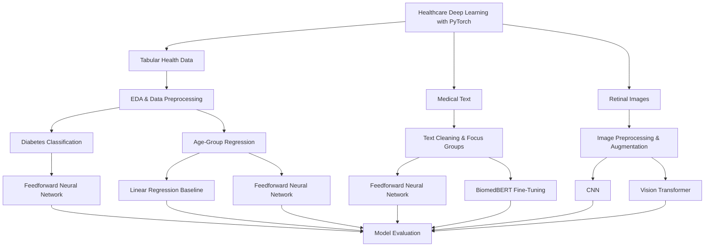

# Healthcare Deep Learning with PyTorch

**Deep Learning · Healthcare Data · PyTorch · NLP · Computer Vision · Tabular Modeling**

## 📌 Overview

This project explores how deep learning can be applied across **three different types of healthcare data**: structured health records, medical text, and retinal images.

Rather than treating each data type as an isolated problem, the project investigates how different neural-network architectures and preprocessing strategies can be adapted to the characteristics of each modality.

The work is organized into three complementary modeling tracks:

1. **Health Factor Modeling** — predicting diabetes and age groups from structured medical and lifestyle variables.
2. **Medical Text Classification** — categorizing medical question-answer text using a feedforward neural network and a fine-tuned BiomedBERT transformer.
3. **Retinal Image Classification** — detecting diabetic retinopathy from retinal fundus images using a CNN and a Vision Transformer.

Across the three notebooks, I performed data exploration, preprocessing, model development, training, evaluation, and model comparison using PyTorch. All notebooks were run locally multiple times to verify the resulting outputs.

---

## 🎯 Project Objectives

The project focuses on several core Data Science objectives:

* Explore and analyze real-world healthcare datasets across different data modalities.
* Develop preprocessing pipelines suited to tabular, textual, and image data.
* Build neural networks with PyTorch for classification and regression tasks.
* Compare baseline models with more advanced neural architectures.
* Handle challenges such as class imbalance, high-cardinality labels, duplicate data, and domain-specific preprocessing.
* Evaluate models using metrics appropriate to each task.
* Critically assess model limitations, especially when working with healthcare-related predictions.

---

## 🏗️ System Architecture



The architecture reflects a shared Data Science workflow while allowing each data modality to use its own preprocessing pipeline and modeling strategy.

---

# 🩺 1. Health Factor Modeling

## Problem Definition

The first part of the project uses structured health and lifestyle information to investigate two predictive problems:

### Diabetes Classification

The objective is to classify whether an individual has diabetes based on measurable health and lifestyle factors.

The original target contained three categories:

* No Diabetes
* Prediabetes
* Diabetes

For the binary classification task, individuals labeled as prediabetic were removed, resulting in a classification problem between **No Diabetes** and **Diabetes**.

### Age-Group Regression

The second task predicts an individual's age group from the remaining medical and lifestyle characteristics.

Although age is represented by 13 ordered categories in the dataset, the task is modeled as regression to preserve the ordinal relationship between age groups.

---

## 📊 Dataset

The analysis uses a subset of the **Behavioral Risk Factor Surveillance System (BRFSS)** dataset collected by the CDC.

The initial dataset contains:

* **253,680 observations**
* **22 variables**

The features include medical, behavioral, and demographic information such as:

* High blood pressure
* High cholesterol
* BMI
* Smoking status
* Stroke history
* Heart disease or heart attack
* Physical activity
* Fruit and vegetable consumption
* General health
* Mental health
* Physical health
* Sex
* Age group
* Education
* Income
* Diabetes status

---

## 🔍 Exploratory Data Analysis

The analysis examines the distribution of diabetes and its relationship with medical, demographic, and lifestyle variables.

A major issue identified during exploration was **class imbalance**.

Before balancing:

* Approximately **84.2%** of individuals belonged to the non-diabetic majority class.
* Approximately **13.9%** belonged to the diabetic class.

Using accuracy alone on this distribution would therefore be misleading because a model could obtain high accuracy simply by favoring the majority class.

---

## ⚙️ Data Preprocessing

Several transformations were applied before training.

### Binary Target Encoding

The diabetes target was converted to:

```text
No Diabetes → 0
Diabetes    → 1
```

Individuals labeled as prediabetic were excluded from the binary classification task.

### Class Balancing

The majority non-diabetic class was undersampled while retaining all diabetic observations.

The resulting dataset contains a **50/50 class distribution**, reducing the risk of the neural network learning a strong majority-class bias.

### Feature Encoding

Categorical variables were converted into numerical representations.

* `Sex` → binary encoding
* `Age` → ordinal encoding from 1 to 13
* `Education` → ordinal encoding
* `Income` → ordinal encoding

Two features were removed from the modeling dataset:

* `CholCheck`
* `NoDocbcCost`

### Train/Test Split

The balanced dataset was divided into:

* **80% training**
* **20% testing**

The resulting tensors contained:

```text
Training: 56,553 observations
Testing:  14,139 observations
Features: 19
```

---

## 🧠 Diabetes Classification

A feedforward neural network was trained with PyTorch to classify diabetic and non-diabetic individuals.

### Model Evaluation

The model achieved:

| Metric                |     Result |
| --------------------- | ---------: |
| Test Accuracy         | **75.53%** |
| No Diabetes Precision |       0.80 |
| No Diabetes Recall    |       0.70 |
| No Diabetes F1        |       0.74 |
| Diabetes Precision    |       0.72 |
| Diabetes Recall       |   **0.82** |
| Diabetes F1           |       0.77 |

The model correctly identified approximately **82% of diabetic individuals** in the testing set.

Because missed positive cases are particularly important in a screening context, recall for the diabetes class provides additional insight beyond overall accuracy.

The model demonstrates useful predictive signal, but its performance is not sufficient to interpret it as a clinically deployable diagnostic system.

---

## 📅 Age-Group Regression

The second task models the ordinal age variable as a regression problem.

Two approaches were compared:

1. **Linear Regression** — baseline model
2. **Feedforward Neural Network** — PyTorch regression model

### Model Evaluation

| Model                      | Test MSE |
| -------------------------- | -------: |
| Linear Regression          | **6.17** |
| Feedforward Neural Network | **5.58** |

The neural network achieved a lower mean squared error than the linear-regression baseline.

This suggests that the nonlinear model captured relationships between health factors and age-group values that were not represented as effectively by the linear model.

---

# 📚 2. Medical Text Classification

## Problem Definition

The second part of the project focuses on automatically categorizing healthcare-related text.

The objective is to classify medical question-answer content into broader medical focus areas.

The task compares:

1. A **feedforward neural network** as a lightweight baseline.
2. A fine-tuned **BiomedBERT transformer** pretrained on biomedical literature.

---

## 📊 Dataset

The analysis uses a subset of the **MedQuAD** dataset.

MedQuAD contains medical question-answer pairs collected from trusted health information sources.

The original dataset contains:

* **16,412 question-answer pairs**
* **5,126 unique focus areas**

Attempting to directly classify thousands of medical topics would result in an extremely sparse multiclass problem.

To make the classification task more focused, the **25 most common medical focus areas** were grouped into five broader categories:

1. Neurological & Cognitive Disorders
2. Cancers
3. Cardiovascular Diseases
4. Metabolic & Endocrine Disorders
5. Other Age-Related & Immune Disorders

After filtering to the selected focus areas and removing missing values, **647 observations** remained.

Duplicate answers were then removed, reducing the modeling dataset to **624 observations**.

---

## 🧹 Text Preprocessing

The medical text required a dedicated NLP preprocessing pipeline.

### Preventing Label Leakage

Medical focus-area terminology appearing directly inside answers could provide the model with an overly obvious shortcut to the target label.

Keywords associated with the focus areas were therefore removed from the training text before modeling.

Whitespace was subsequently normalized.

### Baseline Tokenization

For the feedforward neural network:

* Text was converted to lowercase.
* Regular expressions were used to extract word tokens.
* A vocabulary was constructed from the training corpus.
* Text was encoded into numerical representations for neural-network input.

### Train/Test Split

The processed data was divided into:

* **80% training**
* **20% testing**

Stratification was used to maintain representation of all five focus groups.

---

## 🧠 Feedforward Neural Network Baseline

The first model provides a simpler baseline for evaluating the medical-text classification problem.

### Model Evaluation

The baseline neural network achieved:

| Metric          |  Result |
| --------------- | ------: |
| Accuracy        | **83%** |
| Macro Precision |    0.82 |
| Macro Recall    |    0.80 |
| Macro F1        |    0.81 |

Performance varied by class.

The weakest class was **Metabolic & Endocrine Disorders**, where recall reached only **0.53**. This class was also one of the less represented groups in the dataset.

The baseline nevertheless demonstrated that the text contained strong enough patterns for a relatively simple neural architecture to separate the five medical categories.

---

## 🤖 Fine-Tuned BiomedBERT

A domain-specific transformer was then used to improve the text classifier.

The project uses:

```text
microsoft/BiomedNLP-BiomedBERT-base-uncased-abstract-fulltext
```

BiomedBERT is pretrained on biomedical text, making it better suited to specialized medical language than a generic text representation.

### Transfer-Learning Strategy

Instead of updating the entire transformer, selected parts of the network were fine-tuned:

* Classification head
* Final three transformer encoder layers
* Pooler layer

The remaining parameters were frozen.

Training text was tokenized with a maximum sequence length of **512 tokens** and converted into PyTorch tensors.

### Model Evaluation

BiomedBERT substantially improved performance:

| Metric          |   Result |
| --------------- | -------: |
| Accuracy        |  **98%** |
| Macro Precision | **0.98** |
| Macro Recall    | **0.98** |
| Macro F1        | **0.98** |
| Weighted F1     | **0.98** |

Class-level F1-scores ranged from **0.97 to 1.00**.

This represents a substantial improvement over the 83% feedforward neural-network baseline and demonstrates the value of domain-specific transfer learning for medical NLP.

---

# 👁️ 3. Retinal Image Classification

## Problem Definition

The third part of the project investigates computer vision for detecting **diabetic retinopathy (DR)** from retinal fundus images.

The binary target consists of:

```text
0 → No DR
1 → DR
```

Two image-classification architectures were compared:

1. Convolutional Neural Network
2. Vision Transformer

---

## 📊 Dataset

The project uses the **Indian Diabetic Retinopathy Image Dataset (IDRiD)**.

The original retinal fundus images have a resolution of:

```text
4288 × 2848 pixels
```

The provided dataset contains:

| Split    | Images |
| -------- | -----: |
| Training |    413 |
| Testing  |    103 |

The target distribution is moderately imbalanced, with diabetic-retinopathy images occurring almost twice as frequently as images without DR.

---

## 🖼️ Image Preprocessing & Augmentation

A custom PyTorch dataset class was implemented to connect retinal images with their corresponding labels.

The image pipeline includes domain-specific preprocessing and augmentation.

### Retinal Preprocessing

Custom processing includes:

* Cropping around the circular retinal region
* Contrast enhancement
* Increased contrast in the green image channel
* Resizing images to `224 × 224`

### Data Augmentation

Training transformations include:

* Random horizontal flips
* Random vertical flips
* Random rotations
* Color jitter
* Tensor conversion
* Image normalization

These augmentations increase variation in the training data while maintaining the underlying retinal structures needed for classification.

---

## 🧠 Convolutional Neural Network

A CNN was first trained as the baseline image classifier.

### Model Evaluation

| Metric    | No DR |   DR |
| --------- | ----: | ---: |
| Precision |  0.24 | 0.65 |
| Recall    |  0.12 | 0.81 |
| F1        |  0.16 | 0.72 |

Overall accuracy:

**58%**

The model strongly favored the majority DR class.

Only **12% of No-DR images** were correctly identified, indicating that the CNN had not learned sufficiently balanced and generalizable representations.

The result demonstrates why overall performance and class-level metrics must be considered together when evaluating an imbalanced classification problem.

---

## 🤖 Vision Transformer

A pretrained Vision Transformer was then fine-tuned:

```text
google/vit-base-patch16-224
```

The pretrained classification head was replaced for binary classification.

The ViT preprocessing pipeline retained the retinal cropping and contrast enhancement while applying normalization based on the pretrained image processor.

Class-weighted cross-entropy loss was also used to reduce the impact of class imbalance.

### Model Evaluation

The Vision Transformer achieved:

| Metric    | No DR |       DR |
| --------- | ----: | -------: |
| Precision |  0.74 |     0.85 |
| Recall    |  0.68 | **0.88** |
| F1        |  0.71 | **0.87** |

Overall test accuracy:

**81.55%**

The ViT substantially outperformed the baseline CNN.

Most importantly, performance became considerably more balanced across the two classes:

```text
CNN Accuracy → 58%
ViT Accuracy → 81.55%
```

The result demonstrates the advantage of transfer learning with a pretrained Vision Transformer over the custom CNN in this experiment.

However, the dataset is small and the remaining classification errors are significant. The model should therefore be interpreted as an **experimental proof of concept rather than a clinically deployable diagnostic system**.

---

# 📈 Model Performance Summary

| Task                         | Model                      |              Result |
| ---------------------------- | -------------------------- | ------------------: |
| Diabetes Classification      | Feedforward Neural Network | **75.53% Accuracy** |
| Age-Group Regression         | Linear Regression          |        **6.17 MSE** |
| Age-Group Regression         | Feedforward Neural Network |        **5.58 MSE** |
| Medical Text Classification  | Feedforward Neural Network |    **83% Accuracy** |
| Medical Text Classification  | BiomedBERT                 |    **98% Accuracy** |
| Retinal Image Classification | CNN                        |    **58% Accuracy** |
| Retinal Image Classification | Vision Transformer         | **81.55% Accuracy** |

---

# ⚙️ Key Engineering Challenges

### Handling Different Data Modalities

Each part of the project required a different preprocessing and modeling workflow:

* Numerical and categorical feature encoding for tabular data
* Tokenization and vocabulary construction for text
* Custom datasets, image preprocessing, and augmentation for retinal images

### Managing Class Imbalance

Class imbalance appeared in both the diabetes and retinal-image datasets.

Different strategies were used depending on the task:

* Majority-class undersampling for diabetes classification
* Class-weighted loss functions for retinal classification

### Reducing Medical Text Label Complexity

The original MedQuAD dataset contained **5,126 unique focus areas**.

The most common 25 conditions were mapped into five broader medical categories to create a feasible multiclass classification problem.

### Preventing Text Label Leakage

Medical-topic words could appear directly inside the target answers.

Focus-area keywords were masked from the training text to prevent the models from simply learning explicit label names.

### Adapting Pretrained Transformers

Both advanced models required adapting pretrained architectures to new downstream tasks:

* BiomedBERT → five-class medical text classification
* ViT → binary diabetic-retinopathy classification

Selective fine-tuning allowed the pretrained representations to be reused while training task-specific components.

### Evaluating Healthcare Models Responsibly

The project demonstrates why a high-level metric such as accuracy is not enough.

Class-level precision, recall, and F1-scores exposed weaknesses that would otherwise remain hidden, particularly the CNN's poor ability to identify retinal images without diabetic retinopathy.

---

# 🧠 Technical Skills Demonstrated

* Exploratory Data Analysis
* Data Cleaning & Preprocessing
* Tabular Classification
* Regression Modeling
* Deep Learning with PyTorch
* Feedforward Neural Networks
* Natural Language Processing
* Transformer Fine-Tuning
* Transfer Learning
* Computer Vision
* Convolutional Neural Networks
* Vision Transformers
* Class Imbalance Handling
* Model Evaluation & Comparison
* Precision / Recall / F1 Analysis

---

# 🔍 Key Insights

Several patterns emerged across the three modeling tracks.

### Domain-Specific Pretraining Can Provide Large Performance Gains

BiomedBERT increased medical-text classification accuracy from **83% to 98%**, demonstrating the effectiveness of representations learned from biomedical language.

### Transfer Learning Improved Image Classification

The pretrained Vision Transformer increased retinal classification accuracy from **58% to 81.55%** and substantially improved performance for the minority No-DR class.

### More Complex Models Were Not Evaluated Solely on Accuracy

The diabetes classifier achieved **75.53% accuracy**, but its **82% recall for diabetic individuals** provides additional information about its ability to identify the positive class.

Similarly, the retinal CNN's poor minority-class recall revealed substantial bias that was not adequately described by accuracy alone.

### Neural Regression Outperformed the Linear Baseline

For age-group prediction, the feedforward neural network reduced test MSE from **6.17 to 5.58**, showing an improvement over the linear baseline.

### Healthcare Models Require Careful Interpretation

Strong experimental performance does not imply clinical readiness.

The datasets and evaluation settings in this project are limited, and none of the models are intended to diagnose, predict, or manage real-world medical conditions.

---

# 🚀 Future Steps

Potential extensions identified during the project include:

* Extend diabetes prediction from binary classification to include **Prediabetes** as a third class.
* Explore additional strategies for improving performance on underrepresented medical-text categories.
* Increase the quantity of medical text available for transformer fine-tuning.
* Explore additional CNN and transformer architectures for retinal classification.
* Evaluate specialized pretrained vision models for retinal imaging.
* Investigate alternative class-balancing strategies for diabetic-retinopathy classification.
* Train retinal models on larger image datasets.
* Apply more rigorous validation strategies to evaluate model generalization.

---

# ⚠️ Limitations

Several limitations should be considered when interpreting the results:

* The models were trained and evaluated on limited datasets.
* The medical-text classifier uses a reduced subset of MedQuAD consisting of selected medical focus areas.
* The retinal dataset contains only **413 training images and 103 testing images**.
* Both tabular and retinal classification tasks required explicit strategies for class imbalance.
* Results from these datasets may not generalize to broader populations or real clinical environments.
* The healthcare models are experimental Data Science models and are **not intended for clinical diagnosis or medical decision-making**.

---

# 📦 Technologies

* Python
* PyTorch
* Torchvision
* Hugging Face Transformers

  * BiomedBERT
  * Vision Transformer (ViT)
* Scikit-learn
* Pandas
* NumPy
* Matplotlib
* Seaborn
* Pillow (PIL)
* Jupyter Notebook
* CUDA-enabled PyTorch
