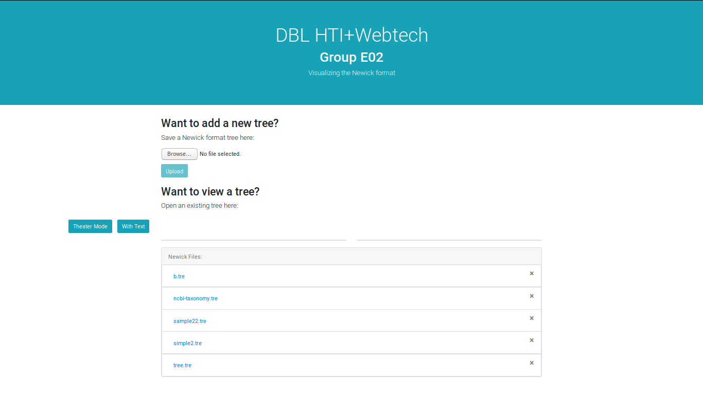
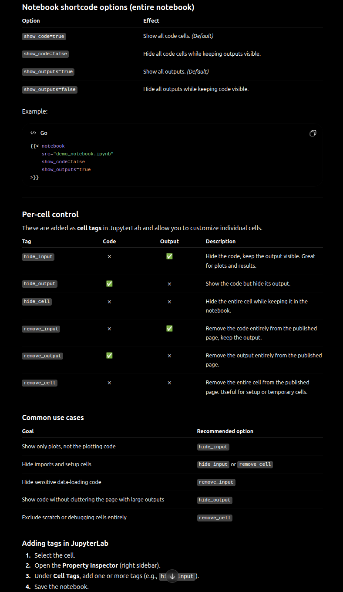

Convert your Jupyter notebooks and RMarkdown documents directly into web posts with embedded code and outputs.

Leverage your computational notebooks to publish reproducible research and tutorials:

- Export your Jupyter `.ipynb` or RMarkdown `.Rmd` files as markdown.
- Include executable code blocks, visualizations, and narrative text.
- Keep your website content in sync with your data and analysis pipeline.

This turns your scientific workflow into dynamic, online documents.

### Research Visualizations


You can add as many as you need by just referencing the filename!

### Analysis Walkthrough


Customizing the View:
