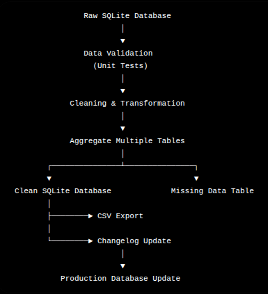

## Overview

This project implements a semi-automated data engineering pipeline that transforms a messy SQLite database into a clean, analytics-ready source of truth.

The pipeline validates incoming data, cleans and transforms records, logs any issues encountered during processing, and updates a production database with newly cleaned data. It was developed with the intention of focusing on production-oriented engineering practices rather than one-off data cleaning.

---

## Features

- Automated ETL pipeline using Bash and Python
- Data validation through unit tests before processing
- Error logging with human-readable log files
- Cleans and standardizes subscriber data
- Joins multiple normalized tables into an analytics-ready dataset
- Separates incomplete records into a dedicated table
- Tracks updates through an automatically generated changelog
- Supports incremental updates to the production database
- Exports cleaned data as both SQLite and CSV

---

## Technology Stack

- Python
- Pandas
- SQLite
- Bash
- unittest
- logging
- Jupyter Notebook

---

## Pipeline Overview

---

## How It Works

Running `script.sh` executes the full pipeline:

1. Runs unit tests to validate incoming data
2. Cleans and transforms the source SQLite database
3. Logs any errors encountered during processing
4. Generates a cleansed SQLite database
5. Creates an analytics-ready aggregated dataset
6. Stores incomplete or missing records separately
7. Exports cleaned data as a CSV file
8. Updates a changelog with pipeline activity
9. Prompts the user before deploying updates to production

---

## Output

The pipeline produces:

- Clean SQLite database
- Aggregated analytics-ready table
- Missing/incomplete data table
- CSV export
- Error logs
- Automated changelog of updates

---

## Development Process

The project began with exploratory data analysis in a Jupyter Notebook. The cleaning logic was then modularized into reusable Python functions and integrated into a Bash-orchestrated pipeline.

This approach demonstrates how exploratory analysis can be transformed into a production-style, repeatable data engineering workflow.

---

## Future Improvements

- Containerize the pipeline using Docker
- Replace Bash orchestration with a workflow tool (e.g., Airflow or Prefect)
- Add configuration via YAML or environment variables
- Expand automated test coverage
- Schedule recurring execution using cron or GitHub Actions