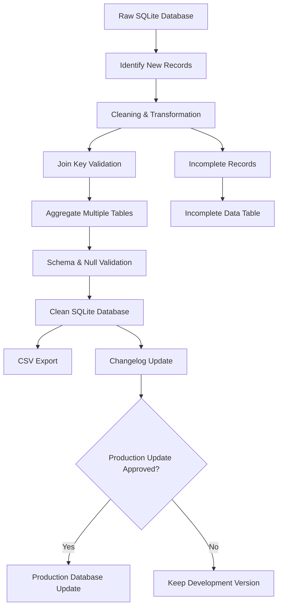

# Subscriber Cancellations Data Pipeline

## 📌 Overview

This project implements a semi-automated data engineering pipeline that transforms a messy, multi-table SQLite database into a clean, analytics-ready source of truth.

The workflow combines exploratory data analysis, reusable Python transformation logic, automated data validation, logging, incremental data processing, and Bash-based orchestration.

Rather than performing one-off data cleaning, the initial discovery process was converted into a repeatable pipeline that can identify new records, clean and validate them, update analytics datasets, and promote approved changes from development to production.

---

## 🎯 Project Objectives

The pipeline was designed to:

- Clean and standardize incoming data.
- Combine multiple normalized database tables into an analytics-ready dataset.
- Preserve incomplete records separately for later inspection.
- Validate data quality before writing new records.
- Process only newly added records during subsequent runs.
- Maintain both SQLite and CSV outputs.
- Track updates through an automatically generated changelog.
- Separate development updates from production deployment.

---

## 🏗️ System Architecture

The pipeline transforms raw relational data into validated, analytics-ready outputs while separating incomplete records and controlling updates to the production environment.


```mermaid
flowchart TD

    A[Raw SQLite Database]
    A --> B[Identify New Records]
    B --> C[Cleaning & Transformation]

    C --> D[Incomplete Records]
    C --> E[Join Key Validation]

    E --> F[Aggregate Multiple Tables]
    F --> G[Schema & Null Validation]

    G --> H[Clean SQLite Database]

    D --> I[Incomplete Data Table]

    H --> J[CSV Export]
    H --> K[Changelog Update]

    K --> L{Production Update Approved?}
    L -->|Yes| M[Production Database Update]
    L -->|No| N[Keep Development Version]
```

The source SQLite database contains three normalized tables:

- `cademycode_students`
- `cademycode_courses`
- `cademycode_student_jobs`

The pipeline cleans and validates new records, combines the tables into `cademycode_aggregated`, stores unresolved incomplete records separately, and updates production outputs only after user approval.

---

## 🔄 Data Pipeline Workflow

### 1. Extract

The three source tables are loaded from the SQLite database into Pandas DataFrames.

### 2. Identify New Records

Incoming student UUIDs are compared with records already stored in the cleaned production database.

Only previously unseen records continue through the transformation pipeline.

### 3. Clean & Transform

Student data is cleaned and standardized, while the supporting career-path and job lookup tables are prepared for integration.

### 4. Validate Relationships

The pipeline checks that required job and career-path identifiers exist in their corresponding lookup tables before joining the data.

### 5. Integrate

The three cleaned relational tables are merged into a single analytics-ready dataset.

### 6. Validate Output

The resulting dataset is checked for null values and, when an existing cleaned database is available, for schema and column compatibility.

### 7. Load

Validated records are appended to the cleaned SQLite database and the aggregated dataset is exported to CSV.

### 8. Track Changes

Each successful update generates a new changelog entry containing information about newly processed and incomplete records.

### 9. Promote to Production

The Bash orchestration script compares the development and production changelog versions and requests approval before copying updated files into production.

---

## ⚙️ Core Components

### Data Cleaning & Transformation

The Python pipeline performs several transformations on the student data:

- Calculates approximate age from date of birth.
- Creates age-group categories.
- Parses structured contact information stored as strings.
- Expands contact information into separate fields.
- Splits mailing addresses into street, city, state, and ZIP code.
- Standardizes numerical data types.
- Handles missing values according to decisions made during exploratory analysis.
- Removes duplicate lookup-table records.

Incomplete records that cannot be safely resolved are stored separately rather than silently discarded.

### Relational Data Integration

The normalized source tables are combined into a single analytics-ready dataset:

```text
cademycode_students
        │
        ├── cademycode_courses
        │
        └── cademycode_student_jobs
        │
        ▼
cademycode_aggregated
```

Before joining, the pipeline verifies that the required identifiers exist in their corresponding lookup tables.

### Incremental Processing

The pipeline compares incoming student UUIDs with records already stored in the cleaned production database.

Only new records are selected for processing, allowing subsequent runs to append data without reprocessing the complete dataset.

### Missing Data Management

Records containing missing values that cannot be safely resolved are separated into an `incomplete_data` table.

This preserves the records for future investigation instead of permanently removing them from the workflow.

### Change Tracking

Each successful update generates a changelog entry containing:

- The new version.
- Number of cleaned records added.
- Number of new incomplete records detected.

The changelog is also used to determine whether the development and production versions differ.

---

## 🔍 How It Works

Running `script.sh` executes the complete workflow:

1. Prompts the user before starting the cleaning process.
2. Runs the Python data-cleaning script.
3. Loads the source SQLite tables.
4. Identifies records that have not already been processed.
5. Cleans and transforms new records.
6. Separates incomplete records.
7. Validates required join keys.
8. Joins student, career-path, and job data.
9. Validates the resulting dataset.
10. Appends valid records to the cleaned SQLite database.
11. Updates the CSV export.
12. Generates a new changelog entry.
13. Compares development and production versions.
14. Requests approval before copying updated outputs into production.

---

## 🛡️ Validation & Reliability

Automated validation is performed before cleaned records are written to the analytics database.

The pipeline checks:

- Whether required `job_id` values exist in the job lookup table.
- Whether required `career_path_id` values exist in the career-path table.
- Whether the cleaned dataset contains null rows.
- Whether the number of columns matches the existing cleaned database.
- Whether column data types match the existing schema.

Validation failures raise an exception and are written to a human-readable log rather than allowing invalid data to continue through the pipeline.

Pipeline execution information is also recorded in `cleanse_db.log`.

---

## 📤 Output

The pipeline generates several outputs for downstream use.

### `cademycode_cleansed.db`

Contains the processed data:

- `cademycode_aggregated` — cleaned and joined analytics data.
- `incomplete_data` — records requiring further inspection.

### `cademycode_cleansed.csv`

CSV representation of the cleaned aggregated dataset for analytics workflows.

### `changelog.md`

Automatically tracks pipeline updates, including newly processed and incomplete records.

### `cleanse_db.log`

Stores pipeline activity and validation errors for debugging and traceability.

---

## ⚙️ Key Technical Challenges

### Transforming Semi-Structured Data

Contact information was stored as structured data inside a string column. The pipeline parses this representation before expanding it into separate contact and address attributes.

### Handling Missing Data Without Losing Traceability

The exploratory analysis identified missing values that could not always be safely inferred.

Instead of permanently deleting these records, the pipeline preserves them in a separate table for future investigation.

### Maintaining Referential Integrity

The final analytics dataset depends on relationships between student, career-path, and job tables.

Validation checks confirm that required identifiers exist before the tables are joined.

### Supporting Incremental Updates

The pipeline avoids unnecessary reprocessing by comparing incoming UUIDs against previously cleaned records and selecting only new data.

### Managing Development and Production Outputs

Updated data is generated and validated in the development environment before being promoted to production.

The Bash orchestration layer adds an explicit approval step before production files are overwritten.

---

## 💡 Key Insights

- Exploratory analysis can be converted into reusable transformation logic rather than remaining inside a notebook.
- Data validation can prevent invalid records from progressing through a pipeline.
- Incomplete data can be preserved separately instead of being silently discarded.
- Incremental processing avoids unnecessary work when only new records need to be transformed.
- Separating development and production outputs creates a more controlled update workflow.
- Logging and change tracking improve the traceability of recurring data-processing jobs.

---

## 🚀 Future Improvements

- Containerize the pipeline using Docker.
- Replace Bash orchestration with a workflow tool such as Airflow or Prefect.
- Add configuration through YAML files or environment variables.
- Expand automated test coverage.
- Schedule recurring execution using cron or GitHub Actions.

---

## 🧠 Technical Skills Demonstrated

- Data Engineering
- ETL Pipeline Development
- Data Cleaning & Transformation
- Data Validation
- Data Quality Testing
- Incremental Data Processing
- Relational Data Integration
- SQLite Database Management
- Python Automation
- Bash Scripting
- Logging & Error Handling
- Development-to-Production Workflows

---

## 📦 Technologies

- Python
- Pandas
- NumPy
- SQLite
- SQLAlchemy
- Bash
- Python Logging
- Jupyter Notebook