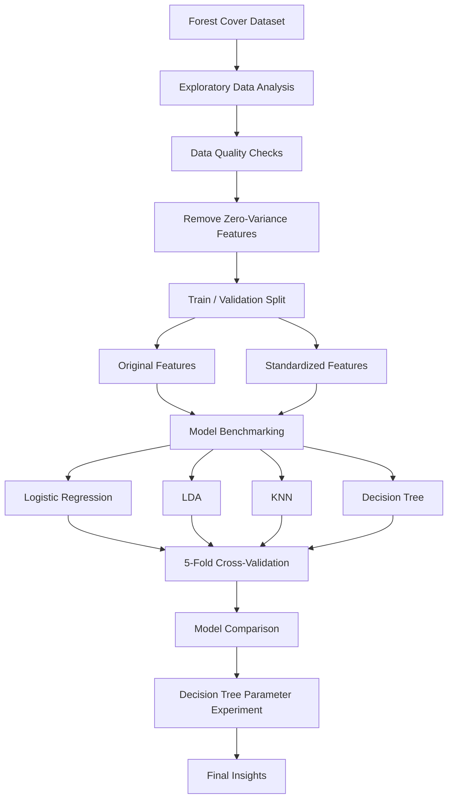

# Forest Cover Classification Pipeline

**Multi-Class Classification | Model Benchmarking | Cross-Validation | Preprocessing Analysis**

---

## 📌 Overview

This project implements an end-to-end machine learning pipeline for classifying forest cover types from cartographic and environmental variables.

Rather than focusing on a single algorithm, the project compares multiple supervised classification approaches under consistent validation settings and examines how preprocessing choices affect model performance.

The workflow covers exploratory data analysis, data-quality checks, preprocessing, model benchmarking, 5-fold cross-validation, Decision Tree parameter experimentation, and comparative model evaluation.

---

## 🎯 Problem Definition

The objective is to predict one of seven forest cover types using cartographic features describing characteristics such as elevation, slope, aspect, hydrological distances, wilderness areas, and soil types.

The project focuses on two questions:

- How do different classification algorithms perform on the same multi-class dataset?
- How does feature standardization affect different model families?

---

## 🏗️ Modelling Pipeline



---

## 📊 Dataset

The dataset contains cartographic and environmental variables used to classify forest areas into seven cover types.

The training data contains:

- **15,120 observations**
- **56 columns**, including the target
- **7 forest cover classes**
- **2,160 observations per class**

The target variable is:

```text
Cover_Type
```

The dataset is balanced across all seven classes, so no class-balancing procedure was required.

---

## 🔍 Exploratory Data Analysis

The exploratory analysis focused on understanding the structure and quality of the dataset before modelling.

### Summary Statistics

Descriptive statistics were examined across the available features to identify distributions, ranges, and potentially redundant variables.

Two soil-type features were found to contain no variation:

```text
Soil_Type7
Soil_Type15
```

Both columns had a standard deviation of zero.

### Feature Distributions

Violin plots were generated across the predictor variables to inspect their distributions in relation to the seven forest cover classes.

### Class Balance

Each target class contains exactly **2,160 observations**, providing an evenly distributed multi-class target.

### Missing Data

The dataset was checked for null values and no missing observations were identified.

---

## ⚙️ Data Preprocessing

### Zero-Variance Feature Removal

Features with a standard deviation of zero were removed before modelling because they provide no discriminatory information.

This removed:

- `Soil_Type7`
- `Soil_Type15`

### Train / Validation Split

The labelled dataset was divided into training and validation subsets using:

```text
Training:   80%
Validation: 20%
Random State: 0
```

The same training data was subsequently used for the cross-validation experiments.

### Feature Standardization

Two versions of the modelling data were prepared:

1. **Original feature values**
2. **Standardized numerical features**

Standardization was applied to the numerical portion of the feature set using `StandardScaler`, while the categorical indicator variables remained unchanged.

This made it possible to directly compare each model with and without numerical feature scaling.

---

## 🧠 Modelling Approach

Four supervised classification algorithms were benchmarked.

### Logistic Regression

Logistic Regression provided a linear classification baseline and was evaluated using both the original and standardized feature sets.

### Linear Discriminant Analysis

Linear Discriminant Analysis (LDA) was evaluated as an alternative linear classification approach.

### K-Nearest Neighbors

K-Nearest Neighbors (KNN) provided a non-parametric classification approach based on distances between observations.

### Decision Tree

A Decision Tree classifier was used as a tree-based non-linear model and was later used for an additional parameter experiment.

---

## 📈 Model Evaluation

Model performance was evaluated using **5-fold cross-validation accuracy**.

Each model was evaluated using the same cross-validation approach on:

- The original feature representation
- The standardized feature representation

For each configuration, both mean accuracy and the standard deviation across the five folds were recorded.

---

## 🔄 Model Comparison

| Model | Feature Representation | Mean CV Accuracy |
|---|---|---:|
| Logistic Regression | Original | **0.3866 ± 0.0098** |
| Logistic Regression | Standardized | **0.5864 ± 0.0150** |
| Linear Discriminant Analysis | Original | **0.6424 ± 0.0086** |
| Linear Discriminant Analysis | Standardized | **0.6424 ± 0.0086** |
| K-Nearest Neighbors | Original | **0.8024 ± 0.0063** |
| K-Nearest Neighbors | Standardized | **0.3402 ± 0.0060** |
| Decision Tree | Original | **0.7810 ± 0.0119** |
| Decision Tree | Standardized | **0.7817 ± 0.0093** |

The strongest configuration in the benchmark was:

```text
K-Nearest Neighbors
Original Features
Mean CV Accuracy: 80.24%
```

The experiments also showed that standardization affected the algorithms differently rather than consistently improving performance.

---

## 🎛️ Hyperparameter Optimization

A targeted Decision Tree parameter experiment was performed after the initial model comparison.

The default Decision Tree configuration was compared with a configuration using:

```text
criterion = entropy
splitter = random
```

The recorded mean 5-fold cross-validation accuracy was approximately:

```text
78.09%
```

The result remained close to the original Decision Tree performance and did not surpass the best-performing KNN configuration.

This experiment showed that changing the splitting strategy and impurity criterion did not produce a substantial improvement in this case.

---

## ⚙️ Key Technical Challenges

### Comparing Different Model Families

The project evaluates linear, distance-based, discriminant, and tree-based classifiers using the same validation strategy.

Keeping the evaluation process consistent made differences between model configurations easier to interpret.

### Evaluating the Effect of Preprocessing

Standardization did not affect every algorithm in the same way.

The pipeline therefore evaluates both original and standardized feature representations rather than assuming scaling will automatically improve performance.

### Working with High-Dimensional Mixed Features

The dataset combines continuous cartographic measurements with binary wilderness-area and soil-type indicators.

The preprocessing workflow therefore distinguishes numerical features from categorical indicator variables when applying standardization.

### Removing Non-Informative Features

Exploratory analysis identified features with zero variance, allowing them to be removed before modelling.

---

## 💡 Key Insights

- **KNN using the original features achieved the highest mean cross-validation accuracy at 80.24%.**
- Logistic Regression benefited substantially from standardization, improving from **38.66% to 58.64%**.
- LDA produced effectively identical performance with and without standardization at approximately **64.24%**.
- KNN performance decreased from **80.24% to 34.02%** when using the standardized representation in this experiment.
- Decision Tree performance remained relatively stable at approximately **78%** across the tested configurations.
- The additional Decision Tree parameter experiment did not produce a meaningful improvement over the initial Decision Tree results.
- Preprocessing choices should be evaluated empirically rather than applied uniformly across model families.

---

## 🚀 Future Steps

Potential extensions of the modelling workflow include:

- Evaluate predictions on additional unseen data.
- Experiment with additional classification algorithms.
- Explore a wider range of hyperparameter configurations.
- Analyze relationships and correlations between predictor variables.
- Investigate additional feature-selection and feature-engineering approaches.

---

## 🧠 Technical Skills Demonstrated

- Exploratory Data Analysis
- Data Cleaning & Preprocessing
- Multi-Class Classification
- Feature Selection
- Feature Standardization
- Model Benchmarking
- Model Selection
- K-Fold Cross-Validation
- Hyperparameter Experimentation
- Comparative Model Evaluation
- Statistical Performance Reporting
- Data Visualization

---

## 📦 Technologies

- Python
- Pandas
- NumPy
- Scikit-learn
- Matplotlib
- Seaborn
- Jupyter Notebook

---

## 📓 Analysis Walkthrough

